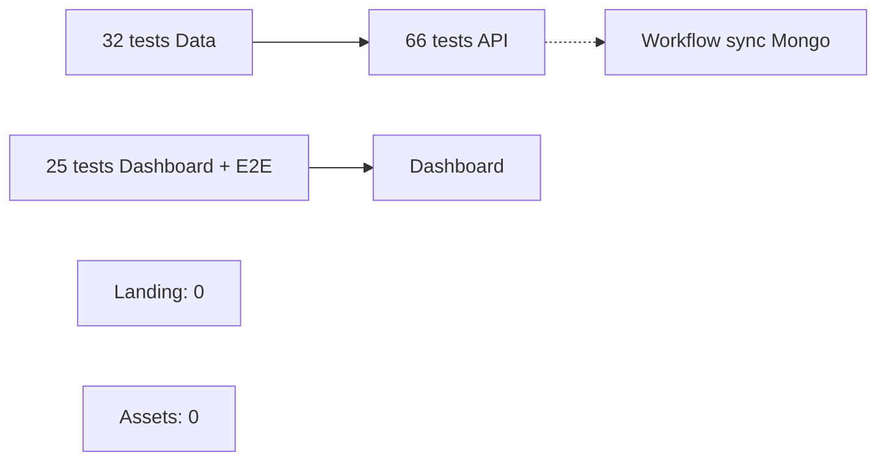

# DOC-021 — Tests

## 1. Périmètre vérifié

Référence des suites de tests, commandes et couvertures réellement présentes dans les cinq dépôts.

Le contenu décrit l’état du code au 13 juillet 2026. Les builds, caches, archives et rapports historiques ne servent pas de preuve runtime lorsqu’un fichier source actif existe.

## 2. Inventaire du code

| Élément | Constat vérifié |
| --- | --- |
| PokemonGo-API- | 10 fichiers, 66 tests node:test |
| PokemonGo-Data | 4 fichiers, 32 tests node:test |
| Dashboard Admin Pokémon | 11 tests |
| Dashboard trainer | 14 tests déclarés |
| Dashboard Learning | 1 scénario E2E séquentiel Playwright + Mongo temporaire |
| Landing et Assets | 0 test |

## 3. Implémentation observée

- npm test de PokemonGo-API lance node --test après ensure-data.
- Les tests API couvrent routes de base, read-only, secret Shiny, cache, adapters current, hash, modèles, pipeline, corruption et indisponibilité Mongo.
- PokemonGo-Data sépare test:pokemon:refactor, test:current-generators et test:ranked-datasets.
- Dashboard expose test:admin-pokemon, test:trainer-pokemon et test:learning-flow; npm run check ne les appelle pas.
- test-trainer-pokemon valide le contrat, les limites IV, la normalisation, les assets exacts et fallback, le read-back, l’absence de deleteMany, la session, l’absence OpenAPI et les états responsive.
- test:admin-pokemon couvre désormais navigation, modale clavier, Background, Shiny, agenda mobile, diagnostics compacts, API Explorer et types d’attaques.
- Le workflow sync-mongodb exécute npm ci puis npm run sync sans tests; le workflow Data dispatch ne lance aucune suite.

## 4. Relations et dépendances

| Source | Relation | Cible |
| --- | --- | --- |
| Tests Data | valident | générateurs et schémas |
| Tests API | valident | routes et pipelines |
| E2E Learning | valide | Dashboard + Mongo réel temporaire |
| Workflow de sync | écrit sans appeler | suites de tests |

## 5. Diagramme vérifié

## 6. Références documentaires

### Documents Foundation

- [DOC-012](./DOC-012-api-overview.md)
- [DOC-013](./DOC-013-data-overview.md)
- [DOC-020](./DOC-020-security.md)
- [DOC-030](./DOC-030-quality-checklist.md)

### Registres actuels

- [Registre api](../../../../audit-documentation/registries/api-routes.json)
- [Registre datasets](../../../../audit-documentation/registries/datasets.json)
- [Registre providers](../../../../audit-documentation/registries/providers.json)
- [Registre components](../../../../audit-documentation/registries/components.json)

### Fiches spécialisées présentes

- [PAGE-049](<../Post-audit 2026-07-13/PAGE-049-ma-collection-pokemon-go.md>)
- [COMP-137](<../Post-audit 2026-07-13/COMP-137-trainer-pokemon-collection-panel.md>)
- [WORKFLOW-016](<../Post-audit 2026-07-13/WORKFLOW-016-import-collection-pokemon-go.md>)

## 7. Informations absentes du code

- Aucun pourcentage de couverture n’est produit.
- Aucun test d’accessibilité automatisé n’est présent.
- Aucun budget de performance automatisé n’est présent.
- Aucun test Landing ou Assets n’est présent.

## 8. Fichiers sources

- `Dashboard Admin/scripts`
- `PokemonGo-API-/test`
- `PokemonGo-Data/scripts`
- `PokemonGo-Data/test`
- `PokemonGo-API-/.github/workflows`
- `PokemonGo-Data/.github/workflows`
