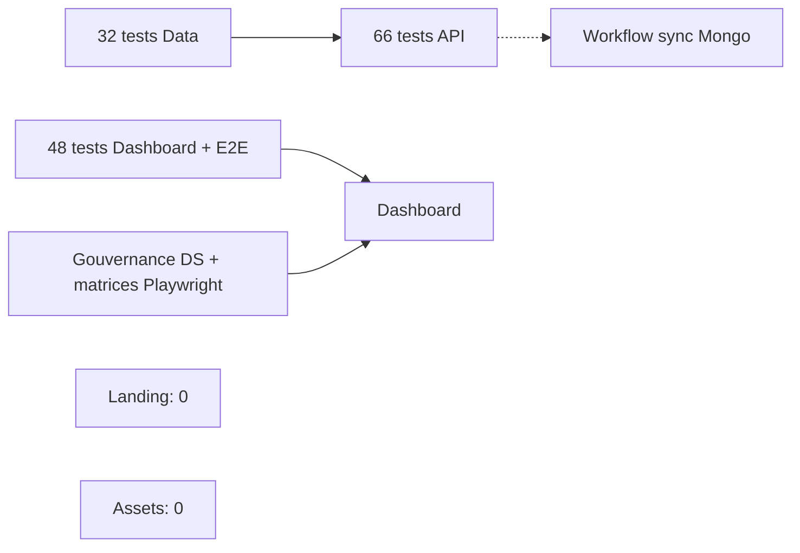

# DOC-021 — Tests

## 1. Périmètre vérifié

Référence des suites de tests, commandes et couvertures réellement présentes dans les cinq dépôts.

Le contenu décrit l’état du code au 26 juillet 2026. Les builds, caches, archives et rapports historiques ne servent pas de preuve runtime lorsqu’un fichier source actif existe.

## 2. Inventaire du code

| Élément | Constat vérifié |
| --- | --- |
| PokemonGo-API- | 10 fichiers, 66 tests node:test |
| PokemonGo-Data | 4 fichiers, 32 tests node:test |
| Dashboard Admin Pokémon | 31 tests |
| Dashboard trainer | 17 tests déclarés, dont 1 fixture volumineux ignoré par défaut |
| Dashboard Learning | 1 scénario E2E séquentiel Playwright + Mongo temporaire |
| Dashboard Design System | commande unifiée `npm run test:design-system`; vérificateurs Playwright versionnés par sprint |
| Landing et Assets | 0 test |

## 3. Implémentation observée

- npm test de PokemonGo-API lance node --test après ensure-data.
- Les tests API couvrent routes de base, read-only, secret Shiny, cache, adapters current, hash, modèles, pipeline, corruption et indisponibilité Mongo.
- PokemonGo-Data sépare test:pokemon:refactor, test:current-generators et test:ranked-datasets.
- Dashboard expose test:admin-pokemon, test:trainer-pokemon et test:learning-flow; npm run check ne les appelle pas.
- test-trainer-pokemon valide le contrat, les limites IV, la normalisation, les assets exacts et fallback, le read-back, l’absence de deleteMany, la session, l’absence OpenAPI et les états responsive.
- test:admin-pokemon couvre désormais navigation, modale clavier, Background, Shiny, agenda mobile, diagnostics compacts, API Explorer et types d’attaques.
- `npm run test:design-system` agrège les scripts de famille, l’accessibilité des formulaires et le garde-fou global. Les assertions portent sur une couverture à 100 %, l’absence de violations compatibles et les registres d’exceptions finis ; elles ne figent pas le nombre de routes, tables, Card ou consommateurs.
- Le garde-fou global refuse les Select/Checkbox natifs hors primitive, les props ErrorState obsolètes, la disparition d’un contrat central et les façades Field locales non composées.
- Les campagnes de sprint conservent leurs scénarios : Motion valide 96 captures normal/reduced, dark/light et trois viewports avec 48 contrôles reduced-motion et 32 interactions.
- Responsive ajoute 7 assertions statiques et une campagne de 20 parcours × 3 viewports × 2 thèmes : 120 vues, 20 interactions, 12 contrôles de modale et 10 contrôles de tableau, sans overflow horizontal ni erreur console/React. La campagne Admin Pokémon couvre en complément 126 vues sur sept largeurs et deux thèmes.
- Le workflow sync-mongodb exécute npm ci puis npm run sync sans tests; le workflow Data dispatch ne lance aucune suite.

## 4. Relations et dépendances

| Source | Relation | Cible |
| --- | --- | --- |
| Tests Data | valident | générateurs et schémas |
| Tests API | valident | routes et pipelines |
| E2E Learning | valide | Dashboard + Mongo réel temporaire |
| Workflow de sync | écrit sans appeler | suites de tests |

## 5. Diagramme vérifié

```mermaid
flowchart LR
  DATA["32 tests Data"] --> API["66 tests API"]
  DASH["48 tests Dashboard + E2E"] --> UI["Dashboard"]
  RESP["Gouvernance DS + matrices Playwright"] --> UI
  API -.-> SYNC["Workflow sync Mongo"]
  LAND["Landing: 0"]
  ASSETS["Assets: 0"]
```

## 6. Références documentaires

### Documents Foundation

- [DOC-012](./DOC-012-api-overview.md)
- [DOC-013](./DOC-013-data-overview.md)
- [DOC-020](./DOC-020-security.md)
- [DOC-030](./DOC-030-quality-checklist.md)

### Registres actuels

- [Registre api](../Reports/Audits/audit-documentation/registries/api-routes.json)
- [Registre datasets](../Reports/Audits/audit-documentation/registries/datasets.json)
- [Registre providers](../Reports/Audits/audit-documentation/registries/providers.json)
- [Registre components](../Reports/Audits/audit-documentation/registries/components.json)

### Fiches spécialisées présentes

- [PAGE-049](<../Tome 2 — Dashboard Admin/PAGE-049-ma-collection-pokemon-go.md>)
- [COMP-137](<../Tome 3 — Design System/Components/COMP-137-trainer-pokemon-collection-panel.md>)
- [WORKFLOW-016](<../Tome 18 - Workflow/WORKFLOW-016-import-collection-pokemon-go.md>)

## 7. Informations absentes du code

- Aucun pourcentage de couverture n’est produit.
- Aucun audit WCAG automatisé complet n’est présent; les campagnes UI vérifient toutefois le clavier, le focus et les noms accessibles des parcours couverts.
- Aucun budget de performance automatisé n’est présent.
- Aucun test Landing ou Assets n’est présent.

## 8. Fichiers sources

- `Dashboard Admin/scripts`
- `PokemonGo-API-/test`
- `PokemonGo-Data/scripts`
- `PokemonGo-Data/test`
- `PokemonGo-API-/.github/workflows`
- `PokemonGo-Data/.github/workflows`
