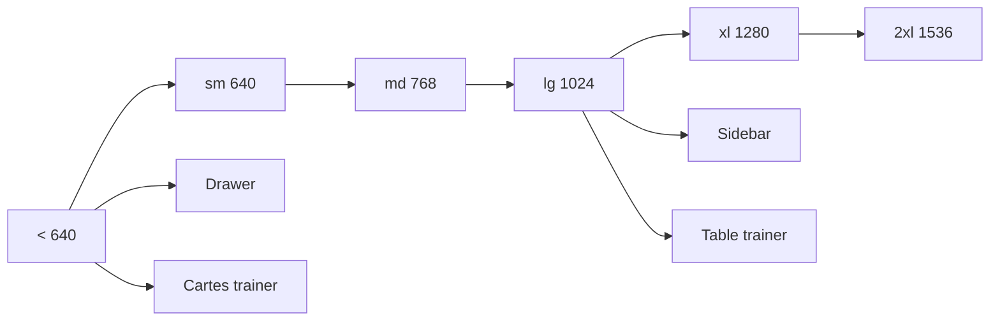

# DOC-023 — Responsive

## 1. Périmètre vérifié

Référence des breakpoints, shells, grilles, modales et variantes mobile/desktop présentes dans les interfaces.

Le contenu décrit l’état du code au 26 juillet 2026. Les builds, caches, archives et rapports historiques ne servent pas de preuve runtime lorsqu’un fichier source actif existe.

## 2. Inventaire du code

| Élément | Constat vérifié |
| --- | --- |
| Breakpoints Tailwind utilisés | sm, md, lg, xl, 2xl |
| Seuils Tailwind | 640, 768, 1024, 1280, 1536 px |
| Routes / fichiers source Dashboard | inventaire dynamique du code courant |
| Sidebar Dashboard | fixe à partir de lg; drawer mobile 286 px borné au viewport |
| Contenu Dashboard | max-width 1680 px |
| Modal commune | w-full et max-height 92dvh |
| Collection trainer | cartes sous lg; table min-width 1540 px à partir de lg |
| Couverture générique | 100 % des racines génériques courantes |
| Matrice de référence | 375×812, 768×1024, 1440×1000; clair et sombre |

## 3. Implémentation observée

- AdminAppFrame bascule par CSS entre sidebar desktop et drawer mobile; aucune logique métier ni donnée ne branche sur la largeur du viewport.
- Le drawer garde une largeur nominale de 286 px, bornée à `calc(100vw - 1rem)`. Il verrouille le body, reçoit/piège le focus, ferme sur Escape et restitue le focus au déclencheur.
- Les écrans métier utilisent des grilles progressives, min-w-0, truncate, overflow et des conteneurs scrollables.
- Les surfaces plein écran utilisent `dvh`; le fallback `vh` n’est conservé que lorsqu’il précède explicitement la valeur dynamique.
- La modale commune fixe un corps scrollable et ferme sur Escape; les modales métier locales conservent leur anatomie tout en garantissant focus, Escape, verrouillage du body et restitution du focus.
- COMP-137 rend PokemonMobileCard avec lg:hidden et PokemonTable avec hidden lg:block; le tableau est placé dans overflow-x-auto.
- La checklist API passe de une à quatre colonnes; son détail devient bottom-sheet sur mobile puis modal centré à partir de sm.
- Le calendrier Events remplace la grille mensuelle dense par des groupes d’agenda sur mobile; la grille complète reste disponible à partir de `sm`.
- Navigation Admin Pokémon, diagnostics source et API Explorer emploient `min-w-0`, retours à la ligne et zones de scroll locales sans masquer les débordements globaux.
- La Landing passe son hero de une à deux colonnes; sa navigation principale est masquée sous md.

La matrice Design System vérifie automatiquement les 20 parcours en 375×812, 768×1024 et 1440×1000, dans les thèmes sombre et clair : 120 vues, 20 interactions, 12 contrôles de modale et 10 contrôles de tableau sans débordement horizontal global, erreur console ou erreur React. La campagne Admin Pokémon ajoute 126 vues sur sept largeurs.

Les usages de breakpoints génériques réutilisent les cinq paliers Tailwind. Quatorze seuils arbitraires restent limités à des compositions métier finies entre 420 et 521 px; aucun seuil arbitraire générique ni branchement JavaScript sur la largeur n’est présent. Le test courant découvre les routes, tables et racines dynamiquement afin qu’une nouvelle feature conforme ne casse pas un compteur historique.

## 4. Relations et dépendances

| Source | Relation | Cible |
| --- | --- | --- |
| Viewport mobile | rend | drawer et cartes |
| Viewport lg | rend | sidebar et tableaux |
| Page, shell et Modal | contraignent | hauteur avec dvh et scroll local |
| Listes | emploient | grilles, pagination ou scroll horizontal |

## 5. Diagramme vérifié

## 6. Références documentaires

### Documents Foundation

- [DOC-010](./DOC-010-design-system-overview.md)
- [DOC-011](./DOC-011-dashboard-overview.md)
- [DOC-021](./DOC-021-testing.md)
- [DOC-022](./DOC-022-performance.md)

### Registres actuels

- [Registre components](../Reports/Audits/audit-documentation/registries/components.json)
- [Registre pages](../Reports/Audits/audit-documentation/registries/pages.json)

### Fiches spécialisées présentes

- [PAGE-049](<../Tome 2 — Dashboard Admin/PAGE-049-ma-collection-pokemon-go.md>)
- [COMP-137](<../Tome 3 — Design System/Components/COMP-137-trainer-pokemon-collection-panel.md>)

## 7. Informations absentes du code

- La matrice de viewports est automatisée, mais aucune matrice officielle d’appareils physiques et navigateurs mobiles n’est présente.
- Aucun test automatique iOS Safari ou Android Chrome n’est présent.
- Aucun test de zoom 200 % ou 400 % n’est présent.

## 8. Fichiers sources

- `Dashboard Admin/src/components/admin/layout/admin-app-frame.tsx`
- `Dashboard Admin/src/components/ui/modal.tsx`
- `Dashboard Admin/src/components/admin/events/events-calendar-panel.jsx`
- `Dashboard Admin/src/components/admin/pokemon/trainer-pokemon-collection-panel.tsx`
- `Dashboard Admin/scripts/test-design-system-responsive.mjs`
- `Dashboard Admin/scripts/verify-design-system-responsive.mjs`
- `PokemonGo-API-/components`
- `Landing-Page-PogoApi/components/landing-experience.jsx`
