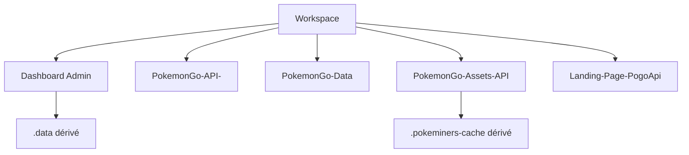

# DOC-024 — Structure des dossiers

## 1. Périmètre vérifié

Référence de l’arborescence active des cinq dépôts et des zones dérivées ou archivées.

Le contenu décrit l’état du code au 13 juillet 2026. Les builds, caches, archives et rapports historiques ne servent pas de preuve runtime lorsqu’un fichier source actif existe.

## 2. Inventaire du code

| Élément | Constat vérifié |
| --- | --- |
| Dashboard Admin | src/app, src/components, src/hooks, src/services, src/lib, src/data, public, scripts |
| PokemonGo-API- | app, api, src/routes, src/models, src/current-datasets, src/sync, src/lib, scripts, test |
| PokemonGo-Data | référentiels JSON, schemas, scripts, test, .github/workflows |
| PokemonGo-Assets-API | familles médias, scripts, miroir et cache PokeMiners |
| Landing-Page-PogoApi | app et components/landing-experience.jsx |
| Zones dérivées | node_modules, .next, .vercel, .data, .pokeminers-cache |

## 3. Implémentation observée

- Dashboard Admin contient 20 pages, 29 fichiers route.ts et 38 méthodes HTTP exportées.
- src/components/admin est le chemin canonique; src/components/dashboard, src/components/pokemon-admin et src/components/checklist contiennent des façades ou chemins legacy.
- PokemonGo-API- contient 26 modules sous src/routes et 22 fichiers sous src/models.
- PokemonGo-Data contient 31 scripts JavaScript actifs et 3 782 fichiers suivis Git.
- PokemonGo-Assets-API contient 22 634 fichiers suivis Git et un volume dérivé plus large dans le miroir PokeMiners.
- Les dossiers .backup, archives, archive JSON et PokemonGo-API-/archive ne participent pas au runtime actif.

## 4. Relations et dépendances

| Source | Relation | Cible |
| --- | --- | --- |
| Dashboard app | importe | components/admin |
| API prebuild | clone | PokemonGo-Data dans .data |
| Assets script | remplit | miroir et cache |
| Archives | restent hors | code actif |

## 5. Diagramme vérifié

## 6. Références documentaires

### Documents Foundation

- [DOC-005](./DOC-005-repositories.md)
- [DOC-006](./DOC-006-architecture-overview.md)
- [DOC-011](./DOC-011-dashboard-overview.md)
- [DOC-013](./DOC-013-data-overview.md)
- [DOC-014](./DOC-014-assets-overview.md)

### Registres actuels

- [Registre pages](../../../../audit-documentation/registries/pages.json)
- [Registre components](../../../../audit-documentation/registries/components.json)
- [Registre datasets](../../../../audit-documentation/registries/datasets.json)
- [Registre assets](../../../../audit-documentation/registries/assets.json)

### Fiches spécialisées présentes

- [PAGE-049](<../Post-audit 2026-07-13/PAGE-049-ma-collection-pokemon-go.md>)
- [COMP-137](<../Post-audit 2026-07-13/COMP-137-trainer-pokemon-collection-panel.md>)

## 7. Informations absentes du code

- La politique de conservation des archives racine n’est pas présente.
- La génération automatique des façades de compatibilité n’est pas présente.
- L’origine de chaque fichier non suivi sous PokemonGo-API-/asset n’est pas codée.

## 8. Fichiers sources

- `Dashboard Admin`
- `Landing-Page-PogoApi`
- `PokemonGo-API-`
- `PokemonGo-Assets-API`
- `PokemonGo-Data`
