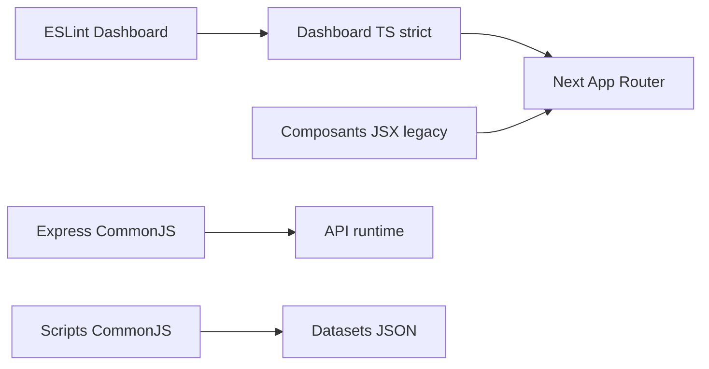

# DOC-025 — Conventions de code

## 1. Périmètre vérifié

Référence des choix de langage, modules, typage, imports, contrôles et exceptions visibles dans le code.

Le contenu décrit l’état du code au 13 juillet 2026. Les builds, caches, archives et rapports historiques ne servent pas de preuve runtime lorsqu’un fichier source actif existe.

## 2. Inventaire du code

| Élément | Constat vérifié |
| --- | --- |
| Dashboard | TypeScript strict, JSX historique, alias @/* |
| API | CommonJS côté Express et scripts; ESM côté Next app |
| Data | scripts CommonJS et JSON |
| Landing | JavaScript/JSX ESM |
| Lint Dashboard | eslint-config-next core-web-vitals et typescript |
| Formatage | aucune configuration Prettier ou EditorConfig |

## 3. Implémentation observée

- Le Dashboard compile avec strict=true, noEmit=true, moduleResolution=bundler et resolveJsonModule=true.
- Les pages et handlers App Router exportent des fonctions ou composants; les composants clients déclarent use client.
- Les imports Dashboard utilisent l’alias @ pour src et des imports relatifs dans les groupes proches.
- Les handlers Next renvoient NextResponse; Express utilise router, asyncHandler, ApiError et middleware central.
- Les scripts de mutation Data/API possèdent des modes dry et :write distincts dans package.json.
- Les exceptions ESLint actives couvrent no-require-imports, no-img-element, set-state-in-effect et exhaustive-deps dans des fichiers nommés.

## 4. Relations et dépendances

| Source | Relation | Cible |
| --- | --- | --- |
| TypeScript | contrôle | Dashboard |
| ESLint | contrôle | Dashboard src hors zones ignorées |
| node:test | contrôle | API, Data et scripts Dashboard |
| CommonJS | structure | Express et générateurs |

## 5. Diagramme vérifié

## 6. Références documentaires

### Documents Foundation

- [DOC-021](./DOC-021-testing.md)
- [DOC-024](./DOC-024-folder-structure.md)
- [DOC-026](./DOC-026-naming-conventions.md)
- [DOC-030](./DOC-030-quality-checklist.md)

### Registres actuels

- [Registre components](../../../../audit-documentation/registries/components.json)
- [Registre services](../../../../audit-documentation/registries/services.json)
- [Registre api](../../../../audit-documentation/registries/api-routes.json)

### Fiches spécialisées présentes

Aucune fiche spécialisée liée n’est présente.

## 7. Informations absentes du code

- Aucune règle de formatage commune aux cinq dépôts n’est présente.
- Aucun commitlint n’est présent.
- Aucune convention de code exécutable n’est présente dans Assets.

## 8. Fichiers sources

- `Dashboard Admin/tsconfig.json`
- `Dashboard Admin/eslint.config.mjs`
- `Dashboard Admin/package.json`
- `PokemonGo-API-/package.json`
- `PokemonGo-Data/package.json`
