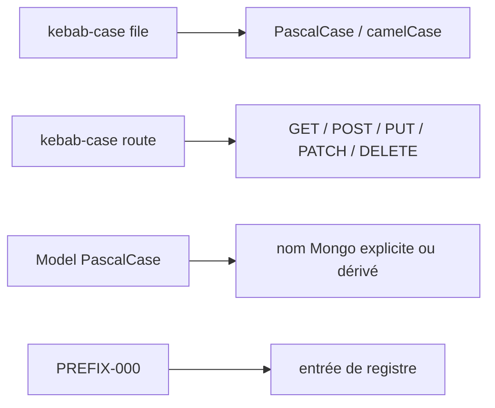

# DOC-026 — Conventions de nommage

## 1. Périmètre vérifié

Référence des conventions de noms réellement observées pour fichiers, symboles, routes, collections, données et variables.

Le contenu décrit l’état du code au 13 juillet 2026. Les builds, caches, archives et rapports historiques ne servent pas de preuve runtime lorsqu’un fichier source actif existe.

## 2. Inventaire du code

| Élément | Constat vérifié |
| --- | --- |
| Fichiers UI | kebab-case.tsx, kebab-case.jsx |
| Composants | PascalCase |
| Hooks | use + PascalCase; fichiers use-kebab-case |
| Routes | segments kebab-case et paramètres [id] ou :id |
| Collections Dashboard | snake_case |
| Variables d’environnement | UPPER_SNAKE_CASE |

## 3. Implémentation observée

- Les services Dashboard portent le suffixe -api ou un nom de store et exportent des fonctions camelCase.
- Les routes Express utilisent des noms de ressources pluriels et des segments kebab-case: max-battles, pvp-rankings et rocket-texts.
- Les collections API conservent plusieurs noms historiques sans séparateur: globalstats, maxbattles et syncruns; pokemonAssets utilise camelCase; shiny_rankings utilise snake_case.
- Les documents Data utilisent dexNr, schemaVersion et generatedAt; le format d’import trainer conserve les champs source mon_number, mon_isShiny et mon_move_1 avant normalisation.
- Les identifiants documentaires utilisent un préfixe et trois chiffres: PAGE-049, COMP-137, API-160, COL-032 et DATASET-020.
- Les noms de dépôts conservent leur casse et le tiret final de PokemonGo-API-.

## 4. Relations et dépendances

| Source | Relation | Cible |
| --- | --- | --- |
| Nom fichier | détermine | module importé |
| Nom route | détermine | endpoint public ou privé |
| Nom collection | est fixé par | Mongoose ou repository Mongo |
| ID documentaire | référence | entrée de registre |

## 5. Diagramme vérifié

## 6. Références documentaires

### Documents Foundation

- [DOC-012](./DOC-012-api-overview.md)
- [DOC-017](./DOC-017-mongodb-overview.md)
- [DOC-024](./DOC-024-folder-structure.md)
- [DOC-025](./DOC-025-coding-guidelines.md)

### Registres actuels

- [Registre api](../../../../audit-documentation/registries/api-routes.json)
- [Registre mongo](../../../../audit-documentation/registries/mongodb-collections.json)
- [Registre datasets](../../../../audit-documentation/registries/datasets.json)
- [Registre components](../../../../audit-documentation/registries/components.json)

### Fiches spécialisées présentes

Aucune fiche spécialisée liée n’est présente.

## 7. Informations absentes du code

- Aucun linter de nommage commun n’est présent.
- Aucune migration ne normalise tous les noms de collections historiques.
- Aucun dictionnaire central de champs JSON n’est présent.

## 8. Fichiers sources

- `Dashboard Admin/src`
- `PokemonGo-API-/src`
- `PokemonGo-Data`
- `audit-documentation/registries`
