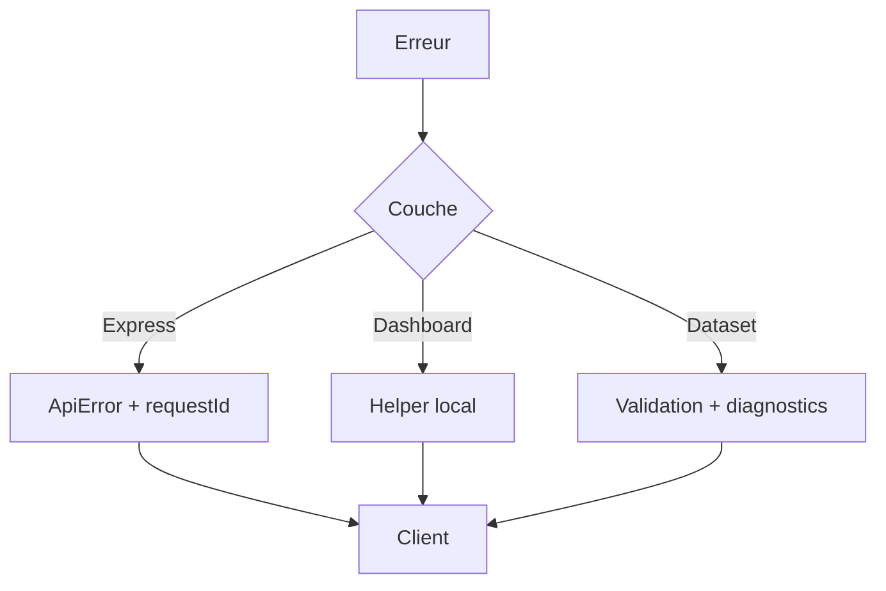

# DOC-027 — Gestion des erreurs

## 1. Périmètre vérifié

Référence des formats, validations, reprises et affichages d’erreur réellement implémentés.

Le contenu décrit l’état du code au 13 juillet 2026. Les builds, caches, archives et rapports historiques ne servent pas de preuve runtime lorsqu’un fichier source actif existe.

## 2. Inventaire du code

| Élément | Constat vérifié |
| --- | --- |
| Erreur Express | { error: { code, message, requestId, details? } } |
| Erreur trainer | { success:false, error:{ code, message, issues? } } |
| Validation Learning | Zod |
| Validation trainer | TrainerPokemonValidationError |
| UI | toasts Sonner et messages inline |
| Error Boundary App Router | 0 fichier error.tsx ou global-error.tsx |

## 3. Implémentation observée

- ApiError transporte status, code et details; asyncHandler transmet au middleware central.
- Le middleware Express masque le message des erreurs 500 en production et inclut requestId dans la réponse.
- Les handlers Dashboard historiques emploient plusieurs formats JSON; securityError et les helpers learning/trainer conservent des statuts contrôlés.
- trainerPokemonServerError masque les 5xx, transforme 502 et 503 en messages fixes et conserve les issues de validation 400.
- La résolution d’asset trainer distingue désormais un fallback canonique (`ASSET_FALLBACK`) d’un asset réellement absent (`MISSING_ASSET`) et interdit tout remplacement d’un shiny par une image normale.
- Le pipeline current refuse les datasets vides ou invalides avant l’upsert et vérifie le read-back après écriture.
- Les composants affichent les erreurs via toast.error, role=alert ou états inline; aucune stratégie retry UI centrale n’est présente.

## 4. Relations et dépendances

| Source | Relation | Cible |
| --- | --- | --- |
| Erreur Express | passe par | middleware central |
| Erreur Dashboard | passe par | catch du handler |
| Erreur pipeline | produit | diagnostics et statut |
| Réponse client | alimente | toast ou message inline |

## 5. Diagramme vérifié

## 6. Références documentaires

### Documents Foundation

- [DOC-012](./DOC-012-api-overview.md)
- [DOC-020](./DOC-020-security.md)
- [DOC-021](./DOC-021-testing.md)
- [DOC-028](./DOC-028-logging.md)

### Registres actuels

- [Registre api](../../../../audit-documentation/registries/api-routes.json)
- [Registre services](../../../../audit-documentation/registries/services.json)
- [Registre datasets](../../../../audit-documentation/registries/datasets.json)

### Fiches spécialisées présentes

- [API-157](<../Post-audit 2026-07-13/API-157-get-trainer-pokemon.md>)
- [API-158](<../Post-audit 2026-07-13/API-158-post-trainer-pokemon-import.md>)
- [API-159](<../Post-audit 2026-07-13/API-159-get-trainer-pokemon-imports.md>)
- [API-160](<../Post-audit 2026-07-13/API-160-post-trainer-pokemon-rollback.md>)
- [WORKFLOW-016](<../Post-audit 2026-07-13/WORKFLOW-016-import-collection-pokemon-go.md>)

## 7. Informations absentes du code

- Aucune taxonomie commune de codes ne couvre Express et Dashboard.
- Aucune Error Boundary applicative n’est présente.
- Aucun test de chaos réseau n’est présent.

## 8. Fichiers sources

- `PokemonGo-API-/src/middleware/errors.js`
- `PokemonGo-API-/src/lib/api-error.js`
- `Dashboard Admin/src/app/api`
- `Dashboard Admin/src/lib/trainer-pokemon/http.ts`
- `PokemonGo-Data/scripts`
