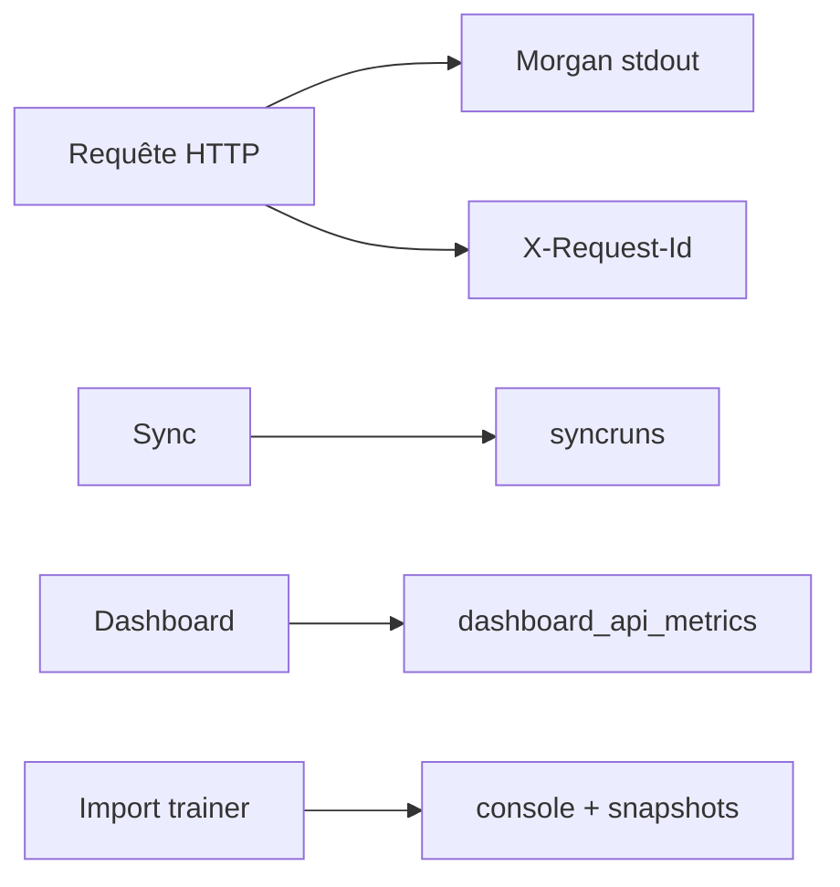

# DOC-028 — Journalisation

## 1. Périmètre vérifié

Référence des logs HTTP, jobs, historiques MongoDB et messages console présents dans le code.

Le contenu décrit l’état du code au 13 juillet 2026. Les builds, caches, archives et rapports historiques ne servent pas de preuve runtime lorsqu’un fichier source actif existe.

## 2. Inventaire du code

| Élément | Constat vérifié |
| --- | --- |
| HTTP API | Morgan combined en production, dev sinon |
| Corrélation Express | X-Request-Id UUID ou valeur entrante |
| Sync statique | collection syncruns |
| Current | diagnostics document + console |
| Dashboard metrics | dashboard_api_metrics |
| Trainer | console.info import/rollback et console.error avant activation |

## 3. Implémentation observée

- Morgan écrit sur stdout; le middleware request-id renvoie X-Request-Id et les erreurs JSON reprennent cet identifiant.
- SyncRun enregistre statut, dates, durée, compteurs, changements et erreur du sync statique.
- Les pipelines current conservent source, hash, diff, compteurs, warnings et résultat de read-back.
- dashboard_api_metrics compte owner, jour, endpoint et méthode; les erreurs d’écriture sont avalées.
- Source Watch conserve au maximum 500 événements dans dashboard_store; Learning conserve activité, imports et versions.
- Le repository trainer journalise owner, snapshotId, count et préfixe de checksum lors d’une activation; l’échec journalise owner, snapshotId et count sans payload utilisateur.

## 4. Relations et dépendances

| Source | Relation | Cible |
| --- | --- | --- |
| Requête API | écrit | Morgan stdout |
| Sync | écrit | syncruns |
| Actions Dashboard | écrivent | métriques et historiques |
| Import trainer | écrit | logs console et snapshots Mongo |

## 5. Diagramme vérifié

## 6. Références documentaires

### Documents Foundation

- [DOC-017](./DOC-017-mongodb-overview.md)
- [DOC-027](./DOC-027-error-handling.md)
- [DOC-029](./DOC-029-monitoring.md)
- [DOC-031](./DOC-031-release-process.md)

### Registres actuels

- [Registre mongo](../../../../audit-documentation/registries/mongodb-collections.json)
- [Registre api](../../../../audit-documentation/registries/api-routes.json)
- [Registre dependencies](../../../../audit-documentation/registries/dependencies.json)

### Fiches spécialisées présentes

- [WORKFLOW-016](<../Post-audit 2026-07-13/WORKFLOW-016-import-collection-pokemon-go.md>)
- [COL-031](<../Post-audit 2026-07-13/COL-031-trainer-pokemon-snapshots.md>)

## 7. Informations absentes du code

- Aucune destination centralisée de logs n’est configurée.
- Aucune durée de rétention stdout n’est codée.
- Aucun requestId Dashboard n’est présent.
- Aucune corrélation end-to-end Dashboard vers API et provider n’est présente.

## 8. Fichiers sources

- `PokemonGo-API-/src/app.js`
- `PokemonGo-API-/src/middleware/request-id.js`
- `PokemonGo-API-/src/models/sync-run.js`
- `Dashboard Admin/src/lib/dashboard-store.ts`
- `Dashboard Admin/src/lib/trainer-pokemon/repository.ts`
