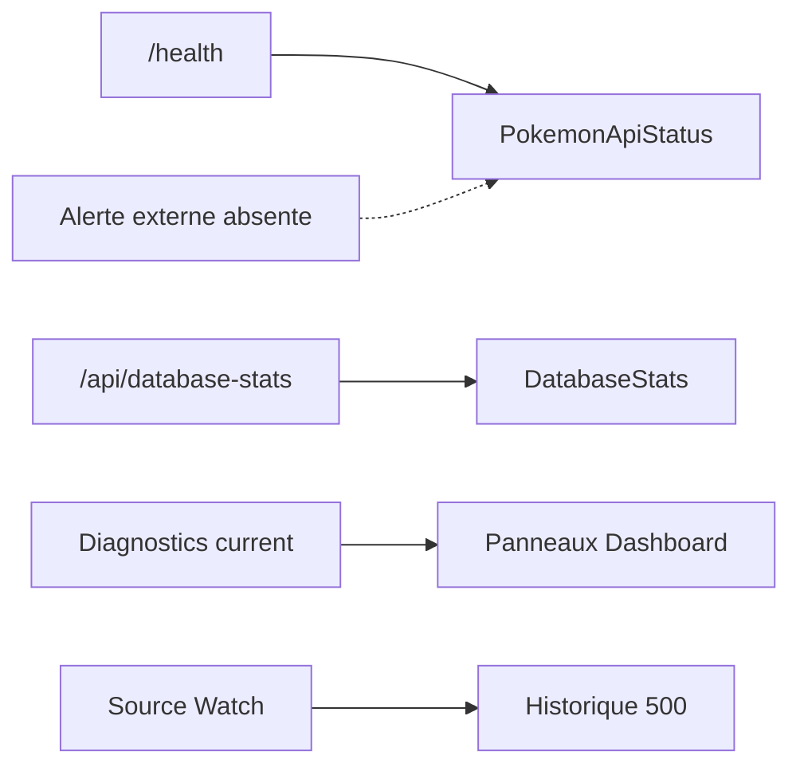

# DOC-029 — Monitoring

## 1. Périmètre vérifié

Référence des surfaces de santé, métriques, diagnostics et alertes présentes ou absentes du code.

Le contenu décrit l’état du code au 13 juillet 2026. Les builds, caches, archives et rapports historiques ne servent pas de preuve runtime lorsqu’un fichier source actif existe.

## 2. Inventaire du code

| Élément | Constat vérifié |
| --- | --- |
| Santé API | GET /health |
| Proxy santé Dashboard | GET /api/pokemon-api-health |
| Statistiques Mongo Dashboard | GET /api/database-stats |
| Veille sources | PAGE-037 / Source Watch |
| Diagnostics current | cinq panneaux publics + Shiny/PvP |
| SDK observabilité externe | 0 |

## 3. Implémentation observée

- GET /health renvoie état DB, uptime et timestamp.
- pokemon-api-health mesure la durée de la requête distante et renvoie les liens de documentation.
- DatabaseStats affiche statistiques de collections et ordre de widgets persistant.
- Les panneaux current affichent source, dates, hash, compteurs, diff et diagnostics issus des documents MongoDB.
- Source Watch compare signatures, ETag, commit ou dates et conserve un historique borné à 500 entrées.
- Les toasts signalent les erreurs pendant la session active; aucun canal externe n’envoie ces signaux.

## 4. Relations et dépendances

| Source | Relation | Cible |
| --- | --- | --- |
| Health | alimente | PokemonApiStatus |
| Mongo stats | alimente | DatabaseStats |
| Diagnostics | alimentent | panneaux Admin Pokémon |
| Source Watch | alimente | veille privée |

## 5. Diagramme vérifié

## 6. Références documentaires

### Documents Foundation

- [DOC-018](./DOC-018-cache-overview.md)
- [DOC-022](./DOC-022-performance.md)
- [DOC-028](./DOC-028-logging.md)
- [DOC-030](./DOC-030-quality-checklist.md)

### Registres actuels

- [Registre api](../../../../audit-documentation/registries/api-routes.json)
- [Registre mongo](../../../../audit-documentation/registries/mongodb-collections.json)
- [Registre components](../../../../audit-documentation/registries/components.json)

### Fiches spécialisées présentes

- [PAGE-049](<../Post-audit 2026-07-13/PAGE-049-ma-collection-pokemon-go.md>)
- [WORKFLOW-016](<../Post-audit 2026-07-13/WORKFLOW-016-import-collection-pokemon-go.md>)

Les identifiants non listés dans les fiches spécialisées ci-dessus renvoient uniquement aux registres JSON.

## 7. Informations absentes du code

- Aucun Sentry, OpenTelemetry, Datadog ou New Relic n’est présent.
- Aucun SLO ou SLI n’est codé.
- Aucun seuil d’alerte n’est codé.
- Aucun webhook, email ou canal de notification opérationnelle n’est présent.

## 8. Fichiers sources

- `PokemonGo-API-/src/app.js`
- `Dashboard Admin/src/app/api/pokemon-api-health/route.ts`
- `Dashboard Admin/src/components/admin/stats/database-stats.tsx`
- `Dashboard Admin/src/components/admin/pokemon/source-watch-panel.tsx`
