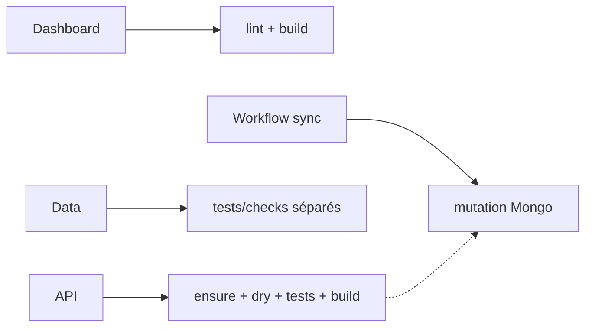

# DOC-030 — Checklist qualité

## 1. Périmètre vérifié

Référence des contrôles réellement exécutables dans chaque dépôt et des étapes absentes des pipelines.

Le contenu décrit l’état du code au 13 juillet 2026. Les builds, caches, archives et rapports historiques ne servent pas de preuve runtime lorsqu’un fichier source actif existe.

## 2. Inventaire du code

| Élément | Constat vérifié |
| --- | --- |
| Dashboard npm run check | lint puis build |
| Dashboard contrôles séparés | typecheck, test:admin-pokemon, test:trainer-pokemon, test:learning-flow |
| API npm run check | ensure:data, sync:dry, test, build |
| Data contrôles | tests séparés et commandes generate:*:check |
| Landing | build et script next lint |
| Assets | aucune commande qualité |

## 3. Implémentation observée

- Le prebuild Dashboard exécute validate:learning et ensure-data avant next build.
- Le typecheck Dashboard utilise tsc --noEmit mais n’est pas inclus dans check.
- Le test trainer couvre validation, normalisation, confidentialité, activation par pointeur et responsive source-level.
- La livraison V1.21.1 exécute en plus 11 tests Admin Pokémon, 14 tests trainer, la validation Learning, le typecheck, le lint, le build et une matrice Playwright de 375 à 1 920 px.
- API check exécute une chaîne complète locale; le workflow sync-mongodb n’appelle pas check.
- Data fournit des modes check pour raids, eggs, max-battles, rocket, research, shiny, pvp-rankings, assets et GameMaster selon package.json.
- Aucun workflow Dashboard, Landing ou Assets n’exécute ces contrôles dans le workspace.

## 4. Relations et dépendances

| Source | Relation | Cible |
| --- | --- | --- |
| Code Dashboard | passe par | lint/build et contrôles séparés |
| Code API | passe localement par | ensure/dry/test/build |
| Push Data | déclenche | dispatch sans test |
| Sync Mongo | exécute | npm run sync sans gate |

## 5. Diagramme vérifié

## 6. Références documentaires

### Documents Foundation

- [DOC-021](./DOC-021-testing.md)
- [DOC-025](./DOC-025-coding-guidelines.md)
- [DOC-027](./DOC-027-error-handling.md)
- [DOC-031](./DOC-031-release-process.md)

### Registres actuels

- [Registre api](../../../../audit-documentation/registries/api-routes.json)
- [Registre datasets](../../../../audit-documentation/registries/datasets.json)
- [Registre components](../../../../audit-documentation/registries/components.json)

### Fiches spécialisées présentes

- [PAGE-049](<../Post-audit 2026-07-13/PAGE-049-ma-collection-pokemon-go.md>)
- [COMP-137](<../Post-audit 2026-07-13/COMP-137-trainer-pokemon-collection-panel.md>)
- [WORKFLOW-016](<../Post-audit 2026-07-13/WORKFLOW-016-import-collection-pokemon-go.md>)

## 7. Informations absentes du code

- Aucune gate CI commune aux cinq dépôts n’est présente.
- Aucun rapport de couverture n’est présent.
- Aucune validation automatique des assets n’est présente.
- Aucun contrôle d’accessibilité ou performance n’est présent dans check.

## 8. Fichiers sources

- `Dashboard Admin/package.json`
- `PokemonGo-API-/package.json`
- `PokemonGo-Data/package.json`
- `Landing-Page-PogoApi/package.json`
- `PokemonGo-API-/.github/workflows`
- `PokemonGo-Data/.github/workflows`
