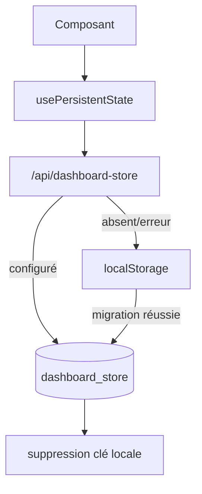

# DOC-032 — Cache local

## 1. Périmètre vérifié

Référence de la persistance navigateur, de sa migration vers MongoDB Dashboard et des clés présentes dans le code.

Le contenu décrit l’état du code au 13 juillet 2026. Les builds, caches, archives et rapports historiques ne servent pas de preuve runtime lorsqu’un fichier source actif existe.

## 2. Inventaire du code

| Élément | Constat vérifié |
| --- | --- |
| Clés matweb détectées | 29 chaînes de base |
| Clés legacy pokedex-v4 | 4 |
| Clés .hidden dynamiques | une par grille SortableWidgetGrid |
| Mode principal usePersistentState | MongoDB dashboard_store |
| Fallback | localStorage |
| Délai d’écriture Mongo | 450 ms |

## 3. Implémentation observée

- usePersistentState lit d’abord la valeur legacy localStorage, puis GET /api/dashboard-store?key= avec cache no-store.
- Si MongoDB est configuré et vide, le hook migre la valeur legacy, l’écrit en base puis supprime la clé navigateur.
- Si la route échoue ou indique une base non configurée, le hook utilise localStorage et l’état initial.
- Les familles matweb couvrent notes, todos, kanban, projects, calendar, writer, palette, pomodoro, learning, outils, ordres de widgets, sidebar, historique de version et déploiement, règles et contrôles Pokémon.
- Les clés legacy sont pokedex-v4-admin-collections, pokedex-v4-admin-todos, pokedex-v4-asset-checks et pokedex-v4-source-watch-signatures.
- Learning migre matweb.js.learning.progress vers matweb.js.learning.progress.v2 puis supprime les deux clés lorsque MongoDB accepte la migration.

## 4. Relations et dépendances

| Source | Relation | Cible |
| --- | --- | --- |
| Composant | appelle | usePersistentState |
| Hook | lit/écrit | dashboard_store |
| Base absente | bascule vers | localStorage |
| Mongo configuré | supprime après migration | clé locale |

## 5. Diagramme vérifié

## 6. Références documentaires

### Documents Foundation

- [DOC-011](./DOC-011-dashboard-overview.md)
- [DOC-017](./DOC-017-mongodb-overview.md)
- [DOC-018](./DOC-018-cache-overview.md)
- [DOC-027](./DOC-027-error-handling.md)

### Registres actuels

- [Registre services](../../../../audit-documentation/registries/services.json)
- [Registre components](../../../../audit-documentation/registries/components.json)
- [Registre mongo](../../../../audit-documentation/registries/mongodb-collections.json)

### Fiches spécialisées présentes

Aucune fiche spécialisée liée n’est présente.

## 7. Informations absentes du code

- Aucun TTL localStorage n’est présent.
- Aucune limite de quota par clé n’est présente.
- Aucune migration globale de schéma ne couvre toutes les clés.
- Aucun chiffrement navigateur n’est présent.

## 8. Fichiers sources

- `Dashboard Admin/src/lib/use-persistent-state.ts`
- `Dashboard Admin/src/services/admin/dashboard-store.js`
- `Dashboard Admin/src/hooks/admin/use-javascript-learning.ts`
- `Dashboard Admin/src/components/admin`
