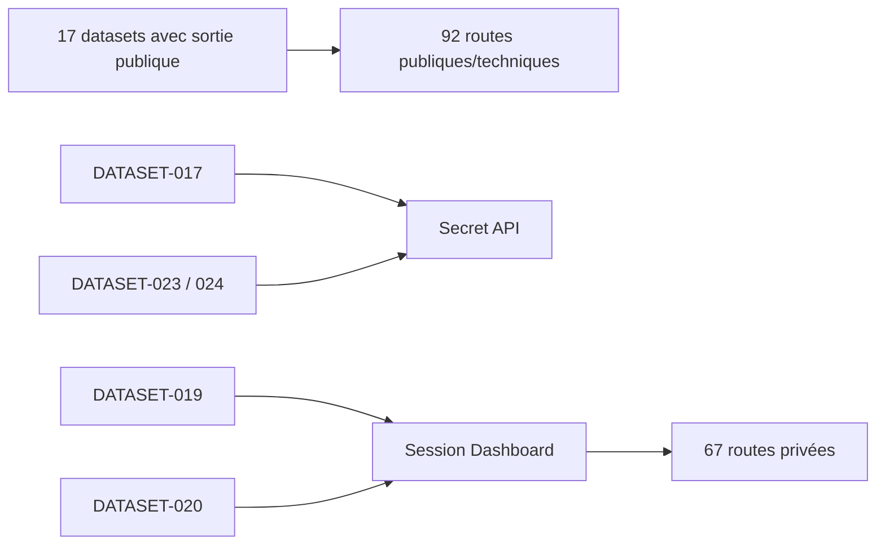

# DOC-033 — Datasets publics et privés

## 1. Périmètre vérifié

Référence de la visibilité effective des 20 datasets, 160 routes, 32 collections et 49 pages ou sections.

Le contenu décrit l’état du code au 13 juillet 2026. Les builds, caches, archives et rapports historiques ne servent pas de preuve runtime lorsqu’un fichier source actif existe.

## 2. Inventaire du code

| Élément | Constat vérifié |
| --- | --- |
| Routes publiques/techniques | 92 |
| Routes privées/admin | 67 |
| Route interne bloquée | 1 |
| Datasets avec sortie publique | 17 |
| Datasets privés | DATASET-017, DATASET-019, DATASET-020, DATASET-023 et DATASET-024 |
| Collections | 16 exposées sélectivement, 15 privées, 1 interne |

## 3. Implémentation observée

- DATASET-001 à 016 et DATASET-018 ont une sortie publique, même lorsque leur dépôt source est privé.
- DATASET-017 Shiny exige le secret sur quatre lectures/mutations, utilise deux collections privées et reste absent d’OpenAPI.
- DATASET-019 Source Watch reste dans le Dashboard privé et dashboard_store.
- DATASET-020 collection du dresseur reste dans PAGE-049, API-157 à API-160 et COL-030 à COL-032; chaque handler vérifie session et rôle admin.
- DATASET-023 et DATASET-024 restent dans PAGE-052, API-165 à API-176 et COL-035 à COL-039. Toutes leurs lectures et écritures exigent le secret API, restent `private, no-store` et sont absentes d’OpenAPI.
- La collection events est privée mais GET /api/events publie une projection métier cacheable.
- Le préfixe /admin de six lectures current ne les rend pas privées; les handlers GET restent publics selon le routeur.

## 4. Relations et dépendances

| Source | Relation | Cible |
| --- | --- | --- |
| Client public | accède | 92 routes publiques/techniques |
| Dashboard | accède avec session | 35 routes privées Dashboard |
| Dashboard BFF | accède avec secret | 32 routes privées API |
| Données trainer | restent dans | MongoDB Dashboard |

## 5. Diagramme vérifié

## 6. Références documentaires

### Documents Foundation

- [DOC-012](./DOC-012-api-overview.md)
- [DOC-016](./DOC-016-dataset-overview.md)
- [DOC-019](./DOC-019-authentication.md)
- [DOC-020](./DOC-020-security.md)

### Registres actuels

- [Registre datasets](../../../../audit-documentation/registries/datasets.json)
- [Registre api](../../../../audit-documentation/registries/api-routes.json)
- [Registre mongo](../../../../audit-documentation/registries/mongodb-collections.json)
- [Registre pages](../../../../audit-documentation/registries/pages.json)
- [Registre providers](../../../../audit-documentation/registries/providers.json)

### Fiches spécialisées présentes

- [PAGE-049](<../Post-audit 2026-07-13/PAGE-049-ma-collection-pokemon-go.md>)
- [COMP-137](<../Post-audit 2026-07-13/COMP-137-trainer-pokemon-collection-panel.md>)
- [API-157](<../Post-audit 2026-07-13/API-157-get-trainer-pokemon.md>)
- [API-158](<../Post-audit 2026-07-13/API-158-post-trainer-pokemon-import.md>)
- [API-159](<../Post-audit 2026-07-13/API-159-get-trainer-pokemon-imports.md>)
- [API-160](<../Post-audit 2026-07-13/API-160-post-trainer-pokemon-rollback.md>)
- [COL-030](<../Post-audit 2026-07-13/COL-030-trainer-pokemon-owners.md>)
- [COL-031](<../Post-audit 2026-07-13/COL-031-trainer-pokemon-snapshots.md>)
- [COL-032](<../Post-audit 2026-07-13/COL-032-trainer-pokemon-entries.md>)
- [DATASET-020](<../Post-audit 2026-07-13/DATASET-020-collection-personnelle-pokemon-go.md>)
- [WORKFLOW-016](<../Post-audit 2026-07-13/WORKFLOW-016-import-collection-pokemon-go.md>)
- [PAGE-052](<../Post-audit 2026-07-15/PAGE-052-game-master-explorer.md>)
- [DATASET-023](<../Post-audit 2026-07-15/DATASET-023-game-master-index-courant.md>)
- [DATASET-024](<../Post-audit 2026-07-15/DATASET-024-game-master-historique-diffs.md>)

Les identifiants non listés dans les fiches spécialisées ci-dessus renvoient uniquement aux registres JSON.

## 7. Informations absentes du code

- Les ACL réelles des dépôts GitHub ne sont pas présentes dans le code local.
- L’exposition réseau Atlas n’est pas présente.
- Les droits de lecture des logs Vercel ne sont pas présents.
- Aucune fiche unitaire de visibilité n’est présente hors registres.

## 8. Fichiers sources

- `PokemonGo-API-/src/routes`
- `PokemonGo-API-/src/current-datasets`
- `Dashboard Admin/src/app/api`
- `Dashboard Admin/src/proxy.ts`
