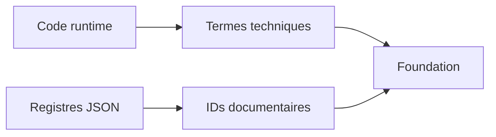

# DOC-034 — Glossaire

## 1. Périmètre vérifié

Définitions tirées des noms, structures et comportements présents dans le code de l’écosystème.

Le contenu décrit l’état du code au 13 juillet 2026. Les builds, caches, archives et rapports historiques ne servent pas de preuve runtime lorsqu’un fichier source actif existe.

## 2. Inventaire du code

| Élément | Constat vérifié |
| --- | --- |
| current | Document MongoDB key=current pour un dataset dynamique |
| référentiel statique | JSON versionné dans PokemonGo-Data puis synchronisé |
| provider | Code qui collecte ou adapte une source externe ou fixture |
| adapter | Contrat d’un domaine current: modèle, validation, count, présentation |
| read-back | Relecture MongoDB après écriture avec contrôle du hash et du count |
| snapshot | Version persistée de données ou métadonnées avant activation ou historique |
| sourceHash | Empreinte canonique utilisée par sync et current |
| BFF | Handlers Dashboard qui appliquent session et relaient ou stockent des données |
| owner | Email de session utilisé pour isoler les documents Dashboard |
| dataset privé | Dataset dont les handlers exigent session ou secret |
| asset | Fichier média publié ou référence JSON vers ce fichier |
| façade | Fichier court qui réexporte un composant canonique |
| dashboard_store | Collection clé/valeur privée du Dashboard |
| SyncRun | Document de statut du sync statique |
| Source Watch | Catalogue et historique de signatures de sources |
| stale | Document absent de la source courante et supprimable par sync |
| rootKey | Clé racine exigée par un import current |
| diagnostics | Métadonnées de parsing, matching, diff, warnings et provenance |
| activeSnapshotId | Pointeur owner vers la collection trainer active |
| OpenAPI | Contrat public généré par src/docs/openapi.js |
| Game Master Explorer | Outil Admin privé qui indexe et recherche le Game Master sans le charger intégralement dans le navigateur |
| staging Game Master | Documents d’un nouveau snapshot écrits avant activation du pointeur `current` |
| comparaison locale | Rapprochement auditable Game Master ↔ PokemonGo-Data avec asset exact, provenance et statut |
| disponibilité asset | Présence d’une image locale valide, indépendante de la disponibilité du Pokémon en jeu |

## 3. Implémentation observée

- Les termes current, sourceHash, diagnostics et read-back sont des champs ou opérations des pipelines API.
- Les termes owner, dashboard_store et activeSnapshotId appartiennent aux repositories MongoDB Dashboard.
- Les identifiants PAGE, COMP, API, COL, DATASET, PROVIDER et ASSET sont attribués par les registres d’audit actuels.
- Le mot Assets dans PokemonGo-Assets-API désigne un dépôt GitHub de fichiers; aucun serveur applicatif propre n’est présent.
- Le terme privé décrit une barrière effective de handler ou de stockage, pas le seul nom d’un chemin.
- Le terme release décrit les versions de package, changelogs et déploiements présents, sans tag Git local.

## 4. Relations et dépendances

| Source | Relation | Cible |
| --- | --- | --- |
| Code | définit | termes runtime |
| Registres | définissent | identifiants documentaires |
| Documents Foundation | emploient | glossaire commun |

## 5. Diagramme vérifié

## 6. Références documentaires

### Documents Foundation

- [DOC-005](./DOC-005-repositories.md)
- [DOC-006](./DOC-006-architecture-overview.md)
- [DOC-013](./DOC-013-data-overview.md)
- [DOC-016](./DOC-016-dataset-overview.md)
- [DOC-017](./DOC-017-mongodb-overview.md)

### Registres actuels

- [Registre map](../../../../audit-documentation/registries/documentation-map.json)
- [Registre dependencies](../../../../audit-documentation/registries/dependencies.json)

### Fiches spécialisées présentes

- [PAGE-052](<../Post-audit 2026-07-15/PAGE-052-game-master-explorer.md>)
- [ADR-012](<../Post-audit 2026-07-15/ADR-012-indexation-snapshots-game-master.md>)
- [RULE-047](<../Post-audit 2026-07-15/RULE-047-fallback-home-formes-normales.md>)

## 7. Informations absentes du code

- Aucun fichier de glossaire officiel distinct n’était présent avant DOC-034.
- Aucune traduction anglaise du glossaire n’est présente.
- Aucun propriétaire de terme n’est codé.

## 8. Fichiers sources

- `Dashboard Admin/src`
- `PokemonGo-API-/src`
- `PokemonGo-Data`
- `PokemonGo-Assets-API`
- `audit-documentation/registries`
