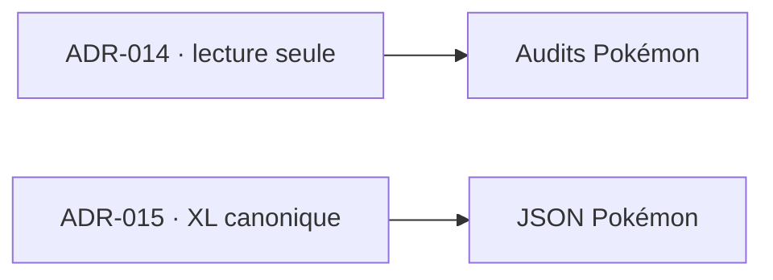

# DOC-035 — Index des ADR

## 1. Périmètre vérifié

Les décisions ADR-001 à ADR-015 sont matérialisées dans `docs/Tome 15 — ADR`. Une fiche acceptée fait autorité avec le code et ses tests ; un ancien rapport d’audit ne remplace pas la décision courante.

## 2. Inventaire

| Groupe | Décisions |
| --- | --- |
| Architecture et providers | ADR-001 à ADR-010 |
| Identités et Game Master | ADR-011 à ADR-013 |
| Sources externes | ADR-014 |
| Bonbons XL | ADR-015 |

## 3. Décisions de fiabilisation

- [ADR-014](../Tome%2015%20%E2%80%94%20ADR/ADR-014-audit-externe-read-only.md) interdit toute écriture implicite depuis un audit externe.
- [ADR-015](../Tome%2015%20%E2%80%94%20ADR/ADR-015-candy-xl-source-canonique.md) impose `assets.candy.xlImage` comme référence résolue.

## 4. Relations

## 5. Règle de mise à jour

Toute nouvelle décision reçoit un ID unique, met à jour cet index et référence les PAGE, PROVIDER, DATASET, COL et RULE concernés.
