# WORKFLOW-016 — Import et activation atomique

```mermaid
flowchart LR
  FILE["Sélection JSON"] --> VALIDATE["Validation complète"]
  VALIDATE --> NORMALIZE["Normalisation canonique"]
  NORMALIZE --> PREVIEW["Aperçu et confirmation"]
  PREVIEW --> SNAPSHOT["Snapshot staging"]
  SNAPSHOT --> READBACK["Read-back volume + IDs"]
  READBACK --> POINTER["Bascule activeSnapshotId"]
  POINTER --> ARCHIVE["Ancien actif archivé"]
```

## Invariants

- Aucune écriture pendant `preview`.
- Aucune suppression de la collection active.
- Un fichier invalide ne crée ni snapshot actif ni entrées visibles.
- Le read-back compare volume et checksum des identifiants.
- La visibilité change par une seule mise à jour du document `COL-030`.
- Un échec de statut après la bascule ne compromet pas la lecture, qui suit le pointeur.
- Le rollback répète le contrôle de propriétaire et de volume avant la même bascule atomique.

## Journalisation

Activation, échec avant activation et rollback sont journalisés sans contenu personnel ni secret.
