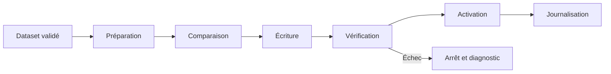

# ARCH-004 — Sync System

## Objectif

Décrire l'architecture générale du système de synchronisation utilisé pour publier les datasets validés vers les couches runtime de l'écosystème Pokémon GO.

---

# Vue d'ensemble

Le système de synchronisation intervient après la génération et la validation des datasets.

```text
Dataset validé
      │
      ▼
Préparation de la synchronisation
      │
      ▼
Comparaison / Diff
      │
      ▼
Écriture dans la cible
      │
      ▼
Vérification
      │
      ▼
Activation
      │
      ▼
Journalisation
```

La synchronisation ne doit jamais publier un dataset invalide ou incomplet.

---

# Responsabilités

Le système de synchronisation est responsable de :

- sélectionner le dataset à publier ;
- vérifier son état de validation ;
- comparer les données courantes avec la nouvelle version ;
- appliquer les modifications nécessaires ;
- vérifier le résultat après écriture ;
- conserver les informations de diagnostic ;
- signaler les erreurs.

---

# Cycle de synchronisation

## 1. Préparation

Le workflow charge le dataset validé et détermine la cible de synchronisation.

## 2. Comparaison

Le système compare la version active avec la nouvelle version afin d'identifier les différences.

## 3. Écriture

Les données sont publiées vers MongoDB ou vers la couche runtime concernée.

## 4. Vérification

Une lecture de contrôle confirme que les données publiées correspondent au dataset attendu lorsque ce mécanisme est disponible.

## 5. Activation

La nouvelle version devient active uniquement après réussite des étapes précédentes.

## 6. Journalisation

Le résultat de la synchronisation est enregistré avec son statut, sa durée et ses diagnostics.

---

# Principes

- Une synchronisation part toujours d'un dataset validé.
- Une erreur bloque l'activation de la nouvelle version.
- La dernière version valide doit être préservée lorsqu'une synchronisation échoue.
- Les opérations sensibles doivent être traçables.
- Les consommateurs ne doivent jamais lire un état intermédiaire volontairement publié.

---

# Architecture retenue



---

# Relations

## Entrées

- datasets validés ;
- workflows ;
- configuration de synchronisation.

## Sorties

- MongoDB ;
- datasets runtime ;
- journaux de synchronisation ;
- diagnostics.

---

# Gestion des erreurs

En cas d'échec :

- l'activation est interrompue ;
- l'erreur est journalisée ;
- la dernière version valide reste disponible lorsque le workflow le permet ;
- aucune réussite ne doit être déclarée sans vérification.

---

# Limites connues

L'audit a identifié plusieurs points à renforcer :

- absence de gate systématique de dry-run sur toutes les synchronisations ;
- rollback transactionnel global non généralisé ;
- contrôles communs hétérogènes entre Providers et mutations de production ;
- planification cron non documentée dans le code audité.

Ces limites doivent rester documentées tant qu'elles ne sont pas corrigées.

---

# Bonnes pratiques

- Valider avant de synchroniser.
- Comparer avant d'écrire.
- Vérifier après écriture.
- Préserver la dernière version valide.
- Journaliser chaque exécution.
- Ne jamais masquer un échec par un fallback silencieux.
- Prévoir un rollback pour les opérations critiques.

---

# Documents liés

- ARCH-002 — Pipeline
- ARCH-003 — Current Dataset Pipeline
- DOC-016 — Dataset Overview
- DOC-017 — MongoDB Overview
- DOC-028 — Logging
- DOC-029 — Monitoring

---

# Historique

## Version 1.0.0 — 2026-07-14

- Création du document décrivant l'architecture du système de synchronisation.
