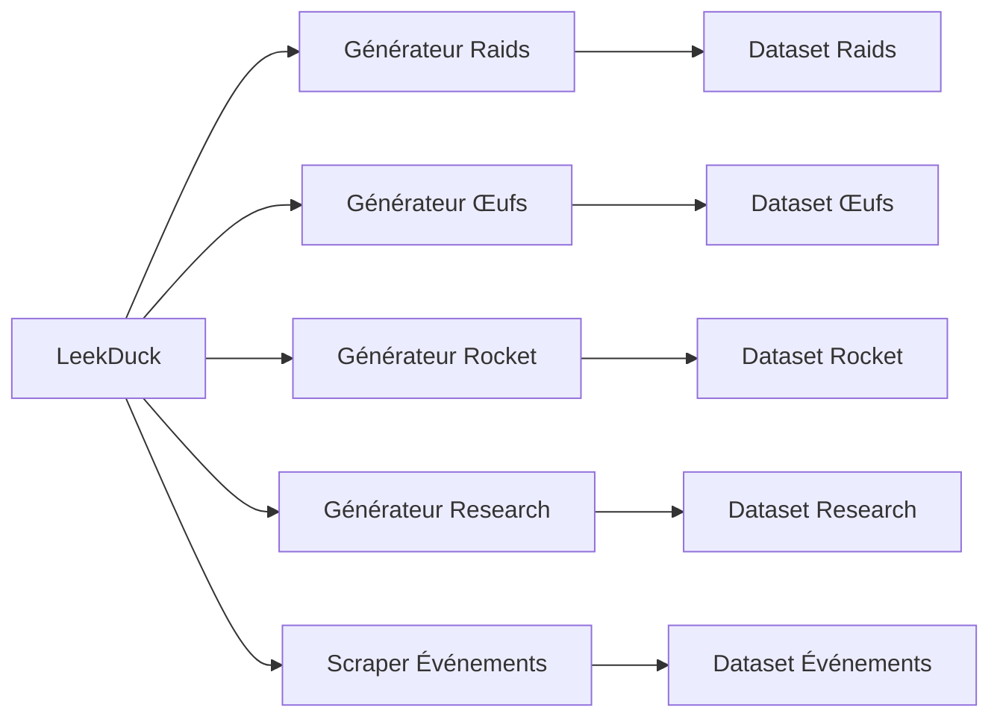

# PROVIDER-001 — LeekDuck

## Objectif

Documenter l'utilisation de **LeekDuck** comme source externe pour plusieurs domaines dynamiques de Pokémon GO.

LeekDuck alimente des générateurs et scrapers distincts. Il ne constitue pas une source de vérité interne : les données récupérées doivent être transformées, normalisées et validées avant leur publication.

---

# Périmètre

Le fournisseur LeekDuck est utilisé pour les domaines suivants :

| Domaine | Implémentation observée | Catégorie |
|---|---|---|
| Raids | `PokemonGo-Data/scripts/generateCurrentRaids.js` | Générateur direct |
| Œufs | `PokemonGo-Data/scripts/generateCurrentEggs.js` | Générateur direct |
| Team GO Rocket | `PokemonGo-Data/scripts/generateCurrentRocket.js` | Générateur direct |
| Études | `PokemonGo-Data/scripts/generateCurrentResearch.js` | Générateur direct |
| Événements | `Dashboard Admin/src/lib/leekduck-events-scraper.ts` | Scraper Dashboard |
| Référence événements | `Dashboard Admin/src/lib/leekduck-events-scraper.ts` | Enrichissement / référence |

Ces implémentations restent séparées dans le code courant.

---

# Architecture



---

# Responsabilités

Les intégrations LeekDuck sont responsables de :

- récupérer les informations propres à leur domaine ;
- parser le contenu retourné par la source ;
- convertir les données vers les structures internes du projet ;
- normaliser les références Pokémon, formes, attaques et Assets lorsque cela est nécessaire ;
- produire des diagnostics exploitables ;
- empêcher la publication volontaire de données invalides.

LeekDuck ne doit pas être interrogé directement par les composants React ni par une requête utilisateur normale de l'API.

---

# Cycle de traitement

```text
LeekDuck
   │
   ▼
Acquisition
   │
   ▼
Parsing
   │
   ▼
Normalisation
   │
   ▼
Validation
   │
   ▼
Diagnostics
   │
   ▼
Dataset
```

Chaque domaine possède son propre générateur ou scraper, mais doit suivre le pipeline Provider commun.

---

# Données produites

## Raids

L'intégration Raids alimente le dataset des boss de raids courants.

Le générateur actif est :

```text
PokemonGo-Data/scripts/generateCurrentRaids.js
```

## Œufs

L'intégration Œufs alimente le dataset des rotations d'œufs courantes.

Le générateur actif est :

```text
PokemonGo-Data/scripts/generateCurrentEggs.js
```

## Team GO Rocket

L'intégration Rocket alimente le dataset consacré aux rotations et données Team GO Rocket.

Le générateur actif est :

```text
PokemonGo-Data/scripts/generateCurrentRocket.js
```

## Études

L'intégration Research alimente le dataset des études courantes.

Le générateur actif est :

```text
PokemonGo-Data/scripts/generateCurrentResearch.js
```

## Événements

Les événements LeekDuck sont récupérés depuis le Dashboard par :

```text
Dashboard Admin/src/lib/leekduck-events-scraper.ts
```

Cette implémentation est distincte des générateurs présents dans `PokemonGo-Data`.

---

# Validation

Les contrôles attendus dans le pipeline Provider comprennent :

- structure valide ;
- champs obligatoires présents ;
- volume cohérent ;
- références Pokémon résolues ;
- formes et alias normalisés ;
- erreurs de parsing explicites ;
- diagnostic avant publication.

Le détail exact de chaque validation reste propre au générateur concerné.

---

# Intégration avec l'écosystème

## PokemonGo-Data

Les générateurs Raids, Œufs, Rocket et Research sont exécutés depuis `PokemonGo-Data`.

## Dashboard Admin

Le Dashboard consomme les datasets produits et contient également le scraper utilisé pour les événements LeekDuck.

## MongoDB

Seuls les datasets validés peuvent être synchronisés vers MongoDB.

## API

L'API expose les données publiées. Elle ne déclenche pas directement un scraping LeekDuck lors d'une requête utilisateur normale.

---

# Journalisation et diagnostics

Les intégrations LeekDuck doivent fournir, lorsque le pipeline le permet :

- statut d'exécution ;
- domaine concerné ;
- date ;
- durée ;
- volume produit ;
- erreurs ;
- résultat de validation ;
- hash ou différence lorsque disponible.

Ces informations alimentent les diagnostics, Source Watch et les historiques de synchronisation.

---

# Sécurité

Les intégrations LeekDuck restent internes.

Elles ne doivent pas exposer :

- secrets ;
- cookies ;
- identifiants privés ;
- informations sensibles dans les journaux.

---

# Limites connues

Les éléments suivants ne sont pas complètement documentés dans le code audité :

- URLs exactes utilisées par chaque générateur ;
- fréquence d'exécution ;
- User-Agent ;
- timeout ;
- stratégie de retry et de backoff ;
- politique de cache ;
- licence ou conditions de réutilisation ;
- procédure commune de fallback ;
- rollback transactionnel global.

Ces informations ne doivent pas être inventées. Elles seront ajoutées lorsque leur implémentation ou leur documentation sera disponible.

---

# Règles obligatoires

- Ne jamais interroger LeekDuck directement depuis un composant UI.
- Ne jamais publier une réponse brute sans normalisation ni validation.
- Ne jamais considérer LeekDuck comme la source de vérité interne.
- Conserver une implémentation séparée par domaine tant qu'aucune interface commune vérifiée ne remplace les générateurs existants.
- Documenter tout changement de source, de parser ou de structure de sortie.

---

# Références

- `DOC-015-provider-overview.md`
- `ARCH-001-provider-architecture.md`
- `ARCH-006-provider-lifecycle.md`
- `ADR-001-provider-architecture.md`
- `ADR-010-provider-interface.md`

---

# Historique

## Version 1.0.0 — 2026-07-14

- Création de la fiche Provider LeekDuck.
- Documentation des intégrations Raids, Œufs, Rocket, Research et Événements observées dans le projet.
