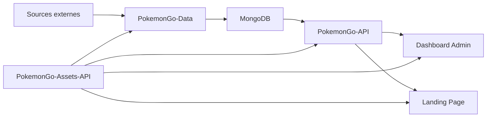
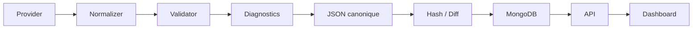

# Vue d'ensemble de l'architecture

> Ce document présente l'architecture globale de la plateforme et les relations entre les différents projets.

## Objectifs de l'architecture

- Séparer clairement les responsabilités.
- Garantir une source de vérité unique.
- Permettre l'ajout de nouveaux Providers et datasets sans réécriture.
- Assurer une publication fiable et atomique des données.
- Offrir une API stable et un Dashboard d'administration complet.

---

# Vision globale



---

# Les cinq piliers

## 1. Sources externes

Les sites externes (LeekDuck, PvPoke, Pokémon GO Live, etc.) fournissent uniquement les informations propres à leur domaine.

Ils ne constituent jamais la source de vérité.

---

## 2. PokemonGo-Data

Responsable de :

- récupération des données ;
- Providers ;
- normalisation ;
- validation ;
- génération JSON ;
- diagnostics ;
- hash ;
- version des datasets.

Aucune interface utilisateur n'y est développée.

---

## 3. MongoDB

MongoDB stocke uniquement les datasets validés.

Chaque publication doit être atomique afin de préserver la dernière version valide.

---

## 4. PokemonGo-API

Expose :

- les datasets publics ;
- les datasets privés authentifiés ;
- les routes d'administration ;
- la documentation OpenAPI.

L'API ne scrape jamais directement une source externe.

---

## 5. Dashboard Admin

Le Dashboard est le poste de contrôle de la plateforme.

Il permet notamment :

- superviser les datasets ;
- lancer les régénérations ;
- publier ;
- consulter les diagnostics ;
- surveiller les Providers ;
- tester les endpoints ;
- administrer les modules privés.

---

# Pipeline principal



---

# Architecture orientée Providers

Chaque nouvelle source suit la même logique :

```text
Source
 ↓
Provider
 ↓
Adapter
 ↓
Validator
 ↓
Dataset
 ↓
MongoDB
 ↓
API
 ↓
Dashboard
```

Cette approche évite les architectures concurrentes et facilite les évolutions.

---

# Source de vérité

La plateforme distingue :

| Élément | Source officielle |
|---------|------------------|
| Pokémon | Données locales |
| Assets | PokemonGo-Assets-API |
| Types | Données locales |
| Attaques | Données locales |
| Classements PvP | Provider PvPoke |
| Raids | Provider LeekDuck |
| Research | Provider LeekDuck |
| Événements | Provider LeekDuck |

Les données externes complètent la plateforme mais ne remplacent jamais les informations locales.

---

# Communication entre les projets

| Projet | Produit | Consommateurs |
|--------|---------|---------------|
| PokemonGo-Data | Datasets | API |
| PokemonGo-API | Routes REST | Dashboard, Landing |
| PokemonGo-Assets-API | Assets | Tous les projets |
| Dashboard | Administration | Utilisateur |
| Landing Page | Documentation | Public |

---

# Principes d'architecture

- Une responsabilité par dépôt.
- Une responsabilité par Provider.
- Un pipeline commun.
- Aucune duplication métier.
- Validation avant publication.
- Documentation avant livraison.

---

# Évolutivité

L'architecture est conçue pour accueillir :

- de nouveaux Providers ;
- de nouveaux datasets ;
- de nouvelles pages Dashboard ;
- de nouvelles routes API ;
- de nouvelles collections MongoDB ;

sans remettre en cause les composants existants.

---

# Conformité

Ce document applique notamment :

- RULE-001 — Préserver l'existant.
- RULE-007 — Responsabilité unique.
- RULE-008 — Architecture orientée Providers.
- RULE-009 — Aucune architecture concurrente.
- RULE-012 — Source de vérité unique.
- RULE-015 — Publication atomique.
- RULE-039 — Identifiants permanents.

---

# Documents associés

- DOC-001 — Règles générales
- DOC-005 — Référentiels
- ARCH-001 — Architecture Providers
- PROVIDER-001 à PROVIDER-009
- DATASET-001 à DATASET-014

---

# Historique

## Version 1.0.0 — 2026-07-12

- Création du document.
- Ajout des schémas d'architecture globale.
- Documentation du pipeline principal.
- Définition des responsabilités des projets.
