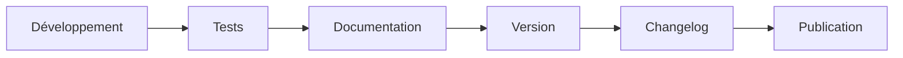

# Versionnage

> Ce document définit la stratégie de versionnage commune à l'ensemble de la plateforme. Toutes les applications, datasets, schémas et providers suivent des conventions homogènes afin de garantir la traçabilité des évolutions.

## Objectifs

- Identifier précisément chaque version.
- Garantir la compatibilité entre les projets.
- Faciliter les retours arrière.
- Rendre les changements compréhensibles.
- Synchroniser le code, les données et la documentation.

---

# Semantic Versioning

Toutes les applications utilisent la convention :

```text
MAJOR.MINOR.PATCH
```

| Niveau | Signification | Exemple |
|--------|---------------|---------|
| MAJOR | Rupture de compatibilité | 2.0.0 |
| MINOR | Nouvelle fonctionnalité compatible | 1.5.0 |
| PATCH | Correction compatible | 1.5.3 |

---

# Éléments versionnés

## Application

```text
appVersion
```

Concerne :

- Dashboard Admin
- PokemonGo-API
- PokemonGo-Data
- PokemonGo-Assets-API
- Landing Page

---

## Datasets

Chaque dataset possède sa propre version.

Exemples :

```text
datasetVersion
schemaVersion
generatedAt
sourceVersion
hash
```

Les datasets ne dépendent pas directement de la version de l'application.

---

## Providers

Chaque Provider possède son propre cycle d'évolution.

```text
providerVersion
```

Une modification d'un Provider n'entraîne pas automatiquement une nouvelle version majeure de l'application.

---

## Schémas

Toute modification de structure entraîne une évolution de :

```text
schemaVersion
```

---

# Politique d'incrémentation

## PATCH

Utiliser PATCH pour :

- correction de bugs ;
- amélioration visuelle ;
- optimisation interne ;
- documentation.

## MINOR

Utiliser MINOR pour :

- nouvelle page ;
- nouveau dataset ;
- nouveau Provider ;
- nouveau composant ;
- nouvelle route API ;
- nouvelle fonctionnalité.

## MAJOR

Utiliser MAJOR lorsque :

- une compatibilité est rompue ;
- un schéma est profondément modifié ;
- une API change de comportement de manière incompatible.

---

# Changelog

Toute version publiée doit être accompagnée d'un changelog décrivant :

- les nouveautés ;
- les corrections ;
- les améliorations ;
- les ruptures éventuelles.

---

# Compatibilité

Avant toute publication, vérifier :

- compatibilité des datasets ;
- compatibilité API ;
- compatibilité Dashboard ;
- compatibilité MongoDB ;
- compatibilité documentation.

---

# Workflow de publication



---

# Bonnes pratiques

- Incrémenter la version avant publication.
- Ne jamais réutiliser un numéro de version.
- Documenter toute rupture de compatibilité.
- Versionner les schémas indépendamment des applications.
- Conserver l'historique des versions.

---

# Conformité

Ce document applique notamment :

- RULE-002 — Archivage.
- RULE-015 — Publication atomique.
- RULE-035 — Semantic Versioning.
- RULE-036 — Distinction des types de version.
- RULE-038 — Mise à jour documentaire.
- RULE-039 — Identifiants permanents.

---

# Documents associés

- DOC-001 — Règles générales
- DOC-006 — Architecture générale
- DOC-008 — Changelog
- ADR-003 — Versionnage

---

# Historique

## Version 1.0.0 — 2026-07-12

- Création du document.
- Définition de la stratégie de versionnage commune.
