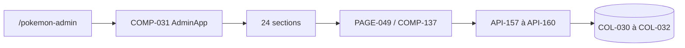

# DOC-011 — Vue d’ensemble du Dashboard

## 1. Périmètre vérifié

Référence du Dashboard Admin, de ses pages, sections, composants, services et dépendances réellement présents.

Le contenu décrit l’état du code au 13 juillet 2026. Les builds, caches, archives et rapports historiques ne servent pas de preuve runtime lorsqu’un fichier source actif existe.

## 2. Inventaire du code

| Élément | Constat vérifié |
| --- | --- |
| Pages routées Dashboard | 20 fichiers page.tsx |
| Sections Admin Pokémon | 24 identifiants dans admin-app.jsx |
| Méthodes API Dashboard | 38 exports GET/POST/PUT/PATCH/DELETE |
| Composants React enregistrés | COMP-001 à COMP-137 sur les trois interfaces |
| Contexte racine | CTX-001, ThemeProvider de next-themes |
| Services Dashboard | SERVICE-001 à SERVICE-005 |

## 3. Implémentation observée

- Le RootLayout monte Providers, puis le layout du groupe dashboard vérifie la session et rend AdminAppFrame.
- La navigation principale contient 18 destinations visibles réparties en cinq groupes; la page Account existe hors navGroups.
- PokemonAdminStudio rend AdminApp. AdminApp contient les 24 sections overview, pokedex, candies, backgrounds, collections, my-collection, assets, catalogs, raids, max-battles, rocket, pvp-rankings, eggs, research, events, shiny, checks, sources, compare, todo, logs, rules, bulk et export.
- La section PAGE-049 charge COMP-137 avec next/dynamic. Elle appelle SERVICE-005 et les routes API-157 à API-160.
- Le design exécuté utilise les thèmes dark et light, huit palettes et les primitives Badge, Button, Card, Input, Textarea et Modal.
- Le Dashboard lit PokemonGo-Data via un voisin ou .data, PokemonGo-API via ses handlers serveur, les assets via GitHub raw et ses données privées via MongoDB Dashboard.

## 4. Relations et dépendances

| Source | Relation | Cible |
| --- | --- | --- |
| PAGE-006 | rend | COMP-049 puis COMP-031 |
| PAGE-049 | rend | COMP-137 |
| COMP-137 | appelle | SERVICE-005 |
| Dashboard | consomme | PokemonGo-API-, PokemonGo-Data, PokemonGo-Assets-API et MongoDB |

## 5. Diagramme vérifié

## 6. Références documentaires

### Documents Foundation

- [DOC-006](./DOC-006-architecture-overview.md)
- [DOC-010](./DOC-010-design-system-overview.md)
- [DOC-012](./DOC-012-api-overview.md)
- [DOC-013](./DOC-013-data-overview.md)

### Registres actuels

- [Registre pages](../../../../audit-documentation/registries/pages.json)
- [Registre components](../../../../audit-documentation/registries/components.json)
- [Registre contexts](../../../../audit-documentation/registries/contexts.json)
- [Registre services](../../../../audit-documentation/registries/services.json)
- [Registre dependencies](../../../../audit-documentation/registries/dependencies.json)

### Fiches spécialisées présentes

- [PAGE-049](<../Post-audit 2026-07-13/PAGE-049-ma-collection-pokemon-go.md>)
- [COMP-137](<../Post-audit 2026-07-13/COMP-137-trainer-pokemon-collection-panel.md>)
- [API-157](<../Post-audit 2026-07-13/API-157-get-trainer-pokemon.md>)
- [API-158](<../Post-audit 2026-07-13/API-158-post-trainer-pokemon-import.md>)
- [API-159](<../Post-audit 2026-07-13/API-159-get-trainer-pokemon-imports.md>)
- [API-160](<../Post-audit 2026-07-13/API-160-post-trainer-pokemon-rollback.md>)
- [COL-030](<../Post-audit 2026-07-13/COL-030-trainer-pokemon-owners.md>)
- [COL-031](<../Post-audit 2026-07-13/COL-031-trainer-pokemon-snapshots.md>)
- [COL-032](<../Post-audit 2026-07-13/COL-032-trainer-pokemon-entries.md>)
- [DATASET-020](<../Post-audit 2026-07-13/DATASET-020-collection-personnelle-pokemon-go.md>)
- [WORKFLOW-016](<../Post-audit 2026-07-13/WORKFLOW-016-import-collection-pokemon-go.md>)

Les identifiants non listés dans les fiches spécialisées ci-dessus renvoient uniquement aux registres JSON.

## 7. Informations absentes du code

- Aucune page Settings autonome n’est présente.
- Aucune section Éditeur autonome n’est présente.
- Aucune fiche Markdown unitaire n’est présente pour PAGE-001 à PAGE-048 ni COMP-001 à COMP-136.

## 8. Fichiers sources

- `Dashboard Admin/src/app`
- `Dashboard Admin/src/components/admin`
- `Dashboard Admin/src/data/dashboard.ts`
- `Dashboard Admin/src/proxy.ts`
