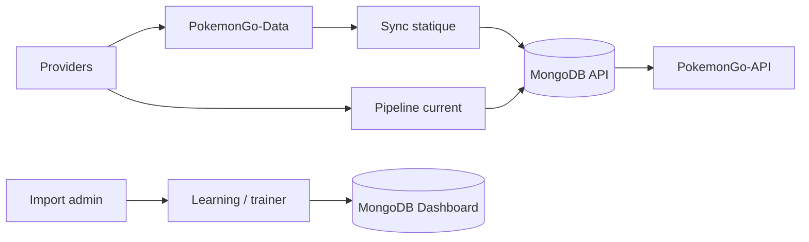

# DOC-013 — Architecture des données

## 1. Périmètre vérifié

Référence des référentiels statiques, datasets courants, données Dashboard et pipelines de transformation.

Le contenu décrit l’état du code au 13 juillet 2026. Les builds, caches, archives et rapports historiques ne servent pas de preuve runtime lorsqu’un fichier source actif existe.

## 2. Inventaire du code

| Élément | Constat vérifié |
| --- | --- |
| Datasets enregistrés | DATASET-001 à DATASET-020 |
| Providers enregistrés | PROVIDER-001 à PROVIDER-018 |
| Collections enregistrées | COL-001 à COL-032 |
| Schémas Data | schemas/pokemon.schema.json et schemas/pokemon-assets.schema.json |
| Pipelines current API | 7 domaines |
| Pipelines privés Dashboard | Learning, Events, Source Watch et collection du dresseur |

## 3. Implémentation observée

- PokemonGo-Data conserve les référentiels Pokémon, formes, assets JSON, moves, types, weather, generations, items, rocket texts et stickers.
- Le sync statique collecte les documents Data, calcule les empreintes, crée les index, exécute les bulk upserts, supprime les entrées stale si SYNC_DELETE_STALE vaut true, met à jour globalstats et écrit syncruns.
- Le pipeline current valide un dataset non vide, calcule hash et diff, upsert le document key=current, invalide le cache et vérifie count et hash après relecture.
- Les cinq JSON raids, eggs, max-battles, rocket et research servent de fixtures, références ou exports; les lectures runtime utilisent MongoDB.
- Learning emploie Zod, des contenus locaux, une migration navigateur, quatre collections de contenu/progression et deux collections d’historique.
- DATASET-020 valide le JSON importé, résout Pokémon, attaques et types via l’API publique, écrit un snapshot puis bascule activeSnapshotId après read-back.

## 4. Relations et dépendances

| Source | Relation | Cible |
| --- | --- | --- |
| Providers | alimentent | générateurs Data |
| PokemonGo-Data | alimente | sync statique API |
| Current pipeline | écrit | MongoDB API |
| Dashboard repositories | écrivent | MongoDB Dashboard |

## 5. Diagramme vérifié

## 6. Références documentaires

### Documents Foundation

- [DOC-006](./DOC-006-architecture-overview.md)
- [DOC-012](./DOC-012-api-overview.md)
- [DOC-015](./DOC-015-provider-overview.md)
- [DOC-016](./DOC-016-dataset-overview.md)
- [DOC-017](./DOC-017-mongodb-overview.md)

### Registres actuels

- [Registre datasets](../../../../audit-documentation/registries/datasets.json)
- [Registre providers](../../../../audit-documentation/registries/providers.json)
- [Registre mongo](../../../../audit-documentation/registries/mongodb-collections.json)
- [Registre dependencies](../../../../audit-documentation/registries/dependencies.json)

### Fiches spécialisées présentes

- [DATASET-020](<../Post-audit 2026-07-13/DATASET-020-collection-personnelle-pokemon-go.md>)
- [COL-030](<../Post-audit 2026-07-13/COL-030-trainer-pokemon-owners.md>)
- [COL-031](<../Post-audit 2026-07-13/COL-031-trainer-pokemon-snapshots.md>)
- [COL-032](<../Post-audit 2026-07-13/COL-032-trainer-pokemon-entries.md>)
- [WORKFLOW-016](<../Post-audit 2026-07-13/WORKFLOW-016-import-collection-pokemon-go.md>)

Les identifiants non listés dans les fiches spécialisées ci-dessus renvoient uniquement aux registres JSON.

## 7. Informations absentes du code

- Aucune transaction globale ne couvre le sync statique.
- Aucun rollback automatique ne couvre les cinq current publics.
- Aucun schemaVersion global ne couvre les 20 datasets.

## 8. Fichiers sources

- `PokemonGo-Data`
- `PokemonGo-API-/src/sync`
- `PokemonGo-API-/src/lib/current-dataset-pipeline.js`
- `Dashboard Admin/src/lib/learning`
- `Dashboard Admin/src/lib/trainer-pokemon`
