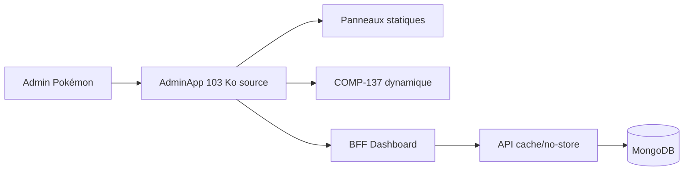

# DOC-022 — Performance

## 1. Périmètre vérifié

Référence des mécanismes de rendu, pagination, cache, images et requêtes qui influencent le coût runtime.

Le contenu décrit l’état du code au 13 juillet 2026. Les builds, caches, archives et rapports historiques ne servent pas de preuve runtime lorsqu’un fichier source actif existe.

## 2. Inventaire du code

| Élément | Constat vérifié |
| --- | --- |
| AdminApp | 2 503 lignes et 103 558 octets |
| Chargement dynamique | COMP-137 uniquement dans AdminApp |
| Cache API | 60 s et 5 000 entrées |
| Accueil API | revalidate=3600 |
| Events public | 60 s + stale 300 s |
| Pagination trainer | 10 à 100 entrées, défaut 50 |

## 3. Implémentation observée

- AdminApp importe statiquement les panneaux historiques et charge TrainerPokemonCollectionPanel avec next/dynamic.
- Les datasets current historiques sont chargés lorsque leur section devient active; le bootstrap Pokémon initial reste global.
- La checklist publique reçoit le bootstrap et le catalogue complets puis limite le rendu initial côté client.
- Les routes principales Pokémon, moves, items, forms, PvP et textes Rocket utilisent skip, limit, countDocuments et lean.
- Les images mélangent next/image et img; la Landing utilise next/image pour ses visuels et hydrate LandingExperience pour GSAP.
- Le repository trainer partage la connexion Mongo par Promise, crée les index au premier accès et exécute pagination, projection, distincts et agrégation de plages en parallèle.

## 4. Relations et dépendances

| Source | Relation | Cible |
| --- | --- | --- |
| Route Admin Pokémon | charge | AdminApp |
| AdminApp | charge dynamiquement | COMP-137 |
| API GET | utilise | cache ou no-store |
| Requêtes listées | utilisent | index, projection et pagination |

## 5. Diagramme vérifié

## 6. Références documentaires

### Documents Foundation

- [DOC-011](./DOC-011-dashboard-overview.md)
- [DOC-012](./DOC-012-api-overview.md)
- [DOC-018](./DOC-018-cache-overview.md)
- [DOC-023](./DOC-023-responsive.md)

### Registres actuels

- [Registre components](../../../../audit-documentation/registries/components.json)
- [Registre api](../../../../audit-documentation/registries/api-routes.json)
- [Registre mongo](../../../../audit-documentation/registries/mongodb-collections.json)

### Fiches spécialisées présentes

- [PAGE-049](<../Post-audit 2026-07-13/PAGE-049-ma-collection-pokemon-go.md>)
- [COMP-137](<../Post-audit 2026-07-13/COMP-137-trainer-pokemon-collection-panel.md>)

Les identifiants non listés dans les fiches spécialisées ci-dessus renvoient uniquement aux registres JSON.

## 7. Informations absentes du code

- Aucun résultat Core Web Vitals n’est présent.
- Aucun budget de bundle n’est présent.
- Aucune mesure p95 ou p99 API/Mongo n’est présente.
- Aucun explain MongoDB n’est conservé.

## 8. Fichiers sources

- `Dashboard Admin/src/components/admin/pokemon/admin-app.jsx`
- `PokemonGo-API-/src/lib/cache.js`
- `PokemonGo-API-/src/services`
- `PokemonGo-API-/components`
- `Landing-Page-PogoApi/components/landing-experience.jsx`
