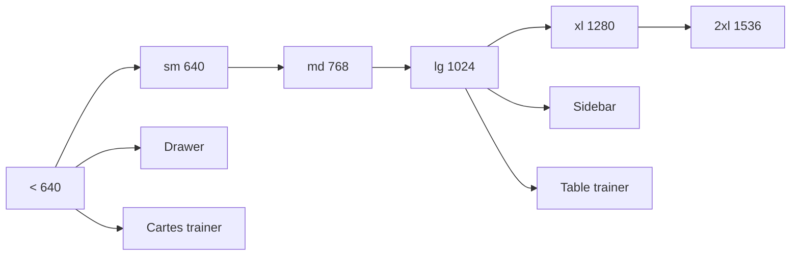

# DOC-023 — Responsive

## 1. Périmètre vérifié

Référence des breakpoints, shells, grilles, modales et variantes mobile/desktop présentes dans les interfaces.

Le contenu décrit l’état du code au 13 juillet 2026. Les builds, caches, archives et rapports historiques ne servent pas de preuve runtime lorsqu’un fichier source actif existe.

## 2. Inventaire du code

| Élément | Constat vérifié |
| --- | --- |
| Breakpoints Tailwind utilisés | sm, md, lg, xl, 2xl |
| Seuils Tailwind | 640, 768, 1024, 1280, 1536 px |
| Sidebar Dashboard | fixe à partir de lg; drawer mobile 286 px |
| Contenu Dashboard | max-width 1680 px |
| Modal commune | w-full et max-height 92dvh |
| Collection trainer | cartes sous lg; table min-width 1540 px à partir de lg |

## 3. Implémentation observée

- AdminAppFrame bascule entre sidebar desktop et drawer mobile; la topbar adapte libellés et actions.
- Les écrans métier utilisent des grilles progressives, min-w-0, truncate, overflow et des conteneurs scrollables.
- La modale commune fixe un corps scrollable et ferme sur Escape; les modales Pokémon et Events ont aussi des implémentations locales.
- COMP-137 rend PokemonMobileCard avec lg:hidden et PokemonTable avec hidden lg:block; le tableau est placé dans overflow-x-auto.
- La checklist API passe de une à quatre colonnes; son détail devient bottom-sheet sur mobile puis modal centré à partir de sm.
- La Landing passe son hero de une à deux colonnes; sa navigation principale est masquée sous md.

## 4. Relations et dépendances

| Source | Relation | Cible |
| --- | --- | --- |
| Viewport mobile | rend | drawer et cartes |
| Viewport lg | rend | sidebar et tableaux |
| Modal | contraint | hauteur avec dvh |
| Listes | emploient | grilles, pagination ou scroll horizontal |

## 5. Diagramme vérifié

## 6. Références documentaires

### Documents Foundation

- [DOC-010](./DOC-010-design-system-overview.md)
- [DOC-011](./DOC-011-dashboard-overview.md)
- [DOC-021](./DOC-021-testing.md)
- [DOC-022](./DOC-022-performance.md)

### Registres actuels

- [Registre components](../../../../audit-documentation/registries/components.json)
- [Registre pages](../../../../audit-documentation/registries/pages.json)

### Fiches spécialisées présentes

- [PAGE-049](<../Post-audit 2026-07-13/PAGE-049-ma-collection-pokemon-go.md>)
- [COMP-137](<../Post-audit 2026-07-13/COMP-137-trainer-pokemon-collection-panel.md>)

## 7. Informations absentes du code

- Aucune matrice officielle d’appareils et navigateurs n’est présente.
- Aucun test automatique iOS Safari ou Android Chrome n’est présent.
- Aucun test de zoom 200 % ou 400 % n’est présent.

## 8. Fichiers sources

- `Dashboard Admin/src/components/admin/layout/admin-app-frame.tsx`
- `Dashboard Admin/src/components/ui/modal.tsx`
- `Dashboard Admin/src/components/admin/pokemon/trainer-pokemon-collection-panel.tsx`
- `PokemonGo-API-/components`
- `Landing-Page-PogoApi/components/landing-experience.jsx`
