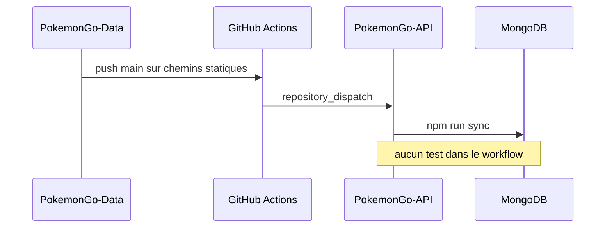

# DOC-031 — Processus de release

## 1. Périmètre vérifié

Référence des versions, changelogs, builds, workflows et mécanismes de déploiement codés.

Le contenu décrit l’état du code au 13 juillet 2026. Les builds, caches, archives et rapports historiques ne servent pas de preuve runtime lorsqu’un fichier source actif existe.

## 2. Inventaire du code

| Élément | Constat vérifié |
| --- | --- |
| Dashboard | package 1.21.0; UI V1.21.0; changelog 1.21.0 |
| PokemonGo-API- | package 1.7.0; OpenAPI 1.4.1; changelog 1.6.1 |
| PokemonGo-Data | package 1.8.0; changelog 1.7.0 |
| Landing | package 1.0.0; aucun changelog |
| Assets | aucun package ni changelog |
| Tags Git locaux | 0 dans les cinq dépôts |

## 3. Implémentation observée

- Les versions de package et changelog sont modifiées manuellement; aucun outil de release n’est installé.
- Vercel construit Dashboard, Landing et API; les prebuild Dashboard/API exécutent ensure-data.
- Un push Data main sur les familles statiques appelle repository_dispatch vers l’API, puis le workflow API exécute npm ci et npm run sync.
- Le Dashboard expose une route privée de deploy hook Vercel, limitée à quatre requêtes par dix minutes et accompagnée d’un historique.
- Learning et la collection trainer possèdent un rollback applicatif de contenu ou de snapshot; le sync statique et les cinq current publics n’ont pas de rollback transactionnel.
- Aucun commit, push ou déploiement n’est exécuté par la génération de cette documentation.

## 4. Relations et dépendances

| Source | Relation | Cible |
| --- | --- | --- |
| Push Data | déclenche | repository_dispatch |
| Action API | exécute | sync Mongo |
| Build Vercel | exécute | ensure-data |
| Bouton Dashboard | appelle | Deploy Hook |

## 5. Diagramme vérifié

## 6. Références documentaires

### Documents Foundation

- [DOC-005](./DOC-005-repositories.md)
- [DOC-007](./DOC-007-versioning.md)
- [DOC-021](./DOC-021-testing.md)
- [DOC-030](./DOC-030-quality-checklist.md)

### Registres actuels

- [Registre dependencies](../../../../audit-documentation/registries/dependencies.json)
- [Registre map](../../../../audit-documentation/registries/documentation-map.json)

### Fiches spécialisées présentes

Aucune fiche spécialisée liée n’est présente.

## 7. Informations absentes du code

- Aucune politique SemVer écrite n’est présente.
- Aucun tag ou GitHub Release localement vérifiable n’est présent.
- Aucune promotion preview vers production n’est codée.
- Aucune procédure de rollback Vercel ou Atlas n’est présente.

## 8. Fichiers sources

- `Dashboard Admin/package.json`
- `Dashboard Admin/CHANGELOG.md`
- `PokemonGo-API-/package.json`
- `PokemonGo-API-/CHANGELOG.md`
- `PokemonGo-Data/package.json`
- `PokemonGo-Data/CHANGELOG.md`
- `PokemonGo-API-/.github/workflows`
- `PokemonGo-Data/.github/workflows`
