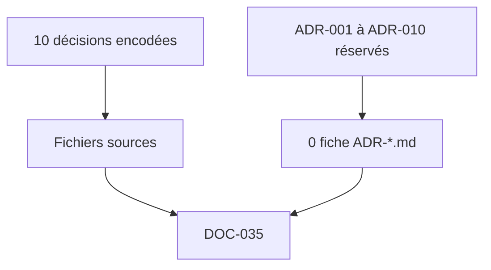

# DOC-035 — Index des ADR

## 1. Périmètre vérifié

Index de l’état réel des décisions architecturales et des fiches ADR présentes dans le workspace.

Le contenu décrit l’état du code au 13 juillet 2026. Les builds, caches, archives et rapports historiques ne servent pas de preuve runtime lorsqu’un fichier source actif existe.

## 2. Inventaire du code

| Élément | Constat vérifié |
| --- | --- |
| Fichiers ADR-*.md présents | 0 |
| Entrées ADR réservées dans documentation-map | ADR-001 à ADR-010 |
| ADR formel accepté | 0 |
| Décisions encodées examinées | 10 |
| Liens vers fiches ADR | 0 |
| Statut | absence explicite de fiches |

## 3. Implémentation observée

- PokemonGo-Data est la source versionnée des référentiels statiques; le workflow dispatch énumère les chemins concernés.
- MongoDB est la source runtime des current raids, eggs, max-battles, rocket et research; le routeur et le reader n’emploient pas les JSON locaux comme fallback.
- Shiny reste privé par adapter, secret, collections et absence OpenAPI.
- La session Dashboard utilise un cookie HMAC de 14 jours et un seul rôle admin.
- Le Dashboard relaie les mutations API avec un secret serveur et stocke ses domaines privés dans une base séparée.
- Le contrat formel dataset-provider reste limité à Shiny et PvP Rankings; les cinq current publics utilisent des générateurs directs.
- Le pipeline current emploie hash, diff, invalidation et read-back; Events conserve un fallback seeds distinct.
- Learning conserve une migration browser et un rollback de contenu.
- La collection trainer conserve les snapshots, vérifie le read-back et active un pointeur owner sans deleteMany.
- Les assets publics sont consommés par URL GitHub raw sur main.
- Ces dix décisions existent dans le code mais aucune ne possède une fiche ADR avec contexte, alternatives, décision et conséquences.

## 4. Relations et dépendances

| Source | Relation | Cible |
| --- | --- | --- |
| Décision codée | est prouvée par | fichier source |
| documentation-map | réserve | ADR-001 à ADR-010 |
| Index | ne crée aucun lien vers | fiche absente |

## 5. Diagramme vérifié

## 6. Références documentaires

### Documents Foundation

- [DOC-006](./DOC-006-architecture-overview.md)
- [DOC-013](./DOC-013-data-overview.md)
- [DOC-019](./DOC-019-authentication.md)
- [DOC-031](./DOC-031-release-process.md)
- [DOC-033](./DOC-033-public-private-datasets.md)

### Registres actuels

- [Registre map](../../../../audit-documentation/registries/documentation-map.json)
- [Registre dependencies](../../../../audit-documentation/registries/dependencies.json)

### Fiches spécialisées présentes

- [WORKFLOW-016](<../Post-audit 2026-07-13/WORKFLOW-016-import-collection-pokemon-go.md>)
- [DATASET-020](<../Post-audit 2026-07-13/DATASET-020-collection-personnelle-pokemon-go.md>)
- [COL-030](<../Post-audit 2026-07-13/COL-030-trainer-pokemon-owners.md>)
- [COL-031](<../Post-audit 2026-07-13/COL-031-trainer-pokemon-snapshots.md>)
- [COL-032](<../Post-audit 2026-07-13/COL-032-trainer-pokemon-entries.md>)

## 7. Informations absentes du code

- Les dates de décision ne sont pas présentes.
- Les alternatives évaluées ne sont pas présentes.
- Les propriétaires et approbateurs de décision ne sont pas présents.
- Les conséquences formalisées dans une fiche ADR ne sont pas présentes.

## 8. Fichiers sources

- `PokemonGo-Data/.github/workflows/dispatch-api-sync.yml`
- `PokemonGo-API-/src/current-datasets/router.js`
- `Dashboard Admin/src/lib/session-token.ts`
- `Dashboard Admin/src/lib/trainer-pokemon/repository.ts`
- `audit-documentation/registries/documentation-map.json`
